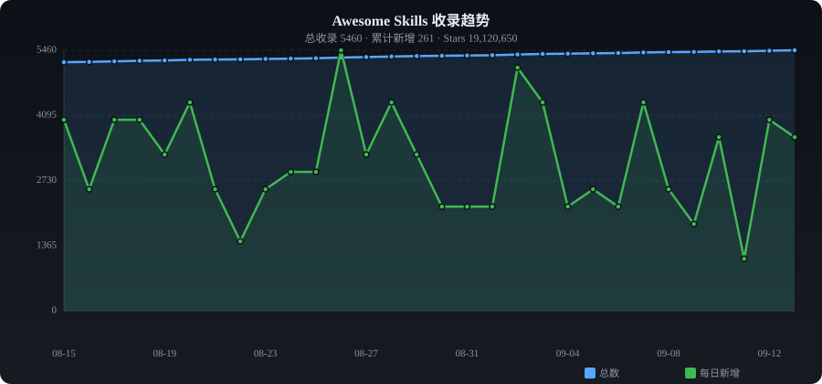

# ✨ Awesome Skills

**English** | [中文](./README_ZH.md)

> Curated collection of AI Agent Skills — auto-collected from GitHub

   

---

## 📈 Trends

---

## 📊 Category Stats

| Category | Count | Share |
|----------|------:|------:|
| 🤖 AI & Machine Learning | 3775 | ████████████████████████ 73.5% |
| 🔌 MCP Servers | 146 | █ 2.8% |
| 📏 Cursor Rules | 22 | █ 0.4% |
| 💬 Prompt Engineering | 166 | █ 3.2% |
| 🔧 Development Tools | 687 | ████ 13.4% |
| 🌐 Web Development | 50 | █ 1.0% |
| ☁️ Cloud & DevOps | 29 | █ 0.6% |
| 🔐 Security | 70 | █ 1.4% |
| 📊 Data Processing | 33 | █ 0.6% |
| ⚡ Automation & Workflow | 19 | █ 0.4% |
| 🎨 UI / UX | 47 | █ 0.9% |
| 💰 Finance | 8 | █ 0.2% |
| 📦 Others | 86 | █ 1.7% |

---

## 🔥 Daily Trending (2026-08-07)

| # | Project | ⭐ | 📈 Gain | Description |
|:-:|---------|---:|-------:|-------------|
| 1 | [chopratejas/headroom](https://github.com/chopratejas/headroom) | 42,866 | +2562 | Compress tool outputs, logs, files, and RAG chunks before th |
| 2 | [mattpocock/skills](https://github.com/mattpocock/skills) | 208,099 | +2122 | My personal directory of skills, straight from my .claude di |
| 3 | [NanmiCoder/claude-code-haha](https://github.com/NanmiCoder/claude-code-haha) | 3,703 | +1736 | Claude Code leaked source - locally runnable version |
| 4 | [forrestchang/andrej-karpathy-skills](https://github.com/forrestchang/andrej-karpathy-skills) | 126,350 | +1728 | A single CLAUDE.md file to improve Claude Code behavior, der |
| 5 | [TencentCloud/TencentDB-Agent-Memory](https://github.com/TencentCloud/TencentDB-Agent-Memory) | 17,198 | +1525 | TencentDB Agent Memory is a team-level memory hub for AI Age |
| 6 | [block/goose](https://github.com/block/goose) | 37,599 | +1484 | an open source, extensible AI agent that goes beyond code su |
| 7 | [addyosmani/agent-skills](https://github.com/addyosmani/agent-skills) | 83,438 | +1115 | Production-grade engineering skills for AI coding agents. |
| 8 | [affaan-m/everything-claude-code](https://github.com/affaan-m/everything-claude-code) | 186,203 | +986 | The agent harness performance optimization system. Skills, i |
| 9 | [safishamsi/graphify](https://github.com/safishamsi/graphify) | 76,579 | +926 | AI coding assistant skill (Claude Code, Codex, OpenCode, Ope |
| 10 | [Lum1104/Understand-Anything](https://github.com/Lum1104/Understand-Anything) | 54,921 | +916 | Claude Code skills that turn any codebase into an interactiv |
| 11 | [diegosouzapw/OmniRoute](https://github.com/diegosouzapw/OmniRoute) | 42,112 | +855 | Never stop coding. Free AI gateway: one endpoint, 160+ provi |
| 12 | [stablyai/orca](https://github.com/stablyai/orca) | 39,350 | +766 | Orca is the next-gen IDE for working with a fleet of paralle |
| 13 | [zhaoxuya520/reverse-skill](https://github.com/zhaoxuya520/reverse-skill) | 20,292 | +765 | Reverse Engineering / Authorized Penetration Testing / Secur |
| 14 | [DietrichGebert/ponytail](https://github.com/DietrichGebert/ponytail) | 97,908 | +763 | Makes your AI agent think like the laziest senior dev in the |
| 15 | [obra/superpowers](https://github.com/obra/superpowers) | 268,470 | +732 | An agentic skills framework & software development methodolo |
| 16 | [esengine/DeepSeek-Reasonix](https://github.com/esengine/DeepSeek-Reasonix) | 32,788 | +710 | DeepSeek-native AI coding agent for your terminal. Engineere |
| 17 | [Leonxlnx/taste-skill](https://github.com/Leonxlnx/taste-skill) | 73,591 | +696 | Taste-Skill (High-Agency Frontend) - gives your AI good tast |
| 18 | [virgiliojr94/book-to-skill](https://github.com/virgiliojr94/book-to-skill) | 17,951 | +654 | Turn any technical book PDF into a Claude Code skill — ready |
| 19 | [herdrdev/herdr](https://github.com/herdrdev/herdr) | 25,437 | +571 | the runtime your coding agents live on |
| 20 | [Graphify-Labs/graphify](https://github.com/Graphify-Labs/graphify) | 103,781 | +523 | AI coding assistant skill (Claude Code, Codex, OpenCode, Cur |

---

## 📁 Categories

- [🤖 AI & Machine Learning](#ai-ml) (3775)
- [🔌 MCP Servers](#mcp) (146)
- [📏 Cursor Rules](#cursor-rules) (22)
- [💬 Prompt Engineering](#prompts) (166)
- [🔧 Development Tools](#dev-tools) (687)
- [🌐 Web Development](#web) (50)
- [☁️ Cloud & DevOps](#cloud) (29)
- [🔐 Security](#security) (70)
- [📊 Data Processing](#data) (33)
- [⚡ Automation & Workflow](#automation) (19)
- [🎨 UI / UX](#ui-ux) (47)
- [💰 Finance](#finance) (8)
- [📦 Others](#other) (86)

---

### 🤖 AI & Machine Learning

| Project | ⭐ | Language | Description |
|---------|---:|:--------:|-------------|
| [obra/superpowers](https://github.com/obra/superpowers) | 268,470 | Shell | An agentic skills framework & software development methodology that wo |
| [openclaw/openclaw](https://github.com/openclaw/openclaw) | 241,485 | TypeScript | Your own personal AI assistant. Any OS. Any Platform. The lobster way. |
| [affaan-m/ECC](https://github.com/affaan-m/ECC) | 238,450 | JavaScript | The agent harness performance optimization system. Skills, instincts,  |
| [mattpocock/skills](https://github.com/mattpocock/skills) | 208,099 | Shell | My personal directory of skills, straight from my .claude directory. |
| [multica-ai/andrej-karpathy-skills](https://github.com/multica-ai/andrej-karpathy-skills) | 200,426 | - | A single CLAUDE.md file to improve Claude Code behavior, derived from  |
| [ultraworkers/claw-code](https://github.com/ultraworkers/claw-code) | 195,005 | Rust | An agent-managed museum exhibit, built in Rust with Gajae-Code / LazyC |
| [anomalyco/opencode](https://github.com/anomalyco/opencode) | 194,593 | TypeScript | The open source coding agent. |
| [affaan-m/everything-claude-code](https://github.com/affaan-m/everything-claude-code) | 186,203 | JavaScript | The agent harness performance optimization system. Skills, instincts,  |
| [Significant-Gravitas/AutoGPT](https://github.com/Significant-Gravitas/AutoGPT) | 186,196 | Python | AutoGPT is the vision of accessible AI for everyone, to use and to bui |
| [f/prompts.chat](https://github.com/f/prompts.chat) | 166,848 | HTML | f.k.a. Awesome ChatGPT Prompts. Share, discover, and collect prompts f |
| [anthropics/skills](https://github.com/anthropics/skills) | 166,841 | Python | Public repository for Agent Skills |
| [Snailclimb/JavaGuide](https://github.com/Snailclimb/JavaGuide) | 157,605 | Java | Java 面试 & 后端通用面试指南，覆盖计算机基础、数据库、分布式、高并发、系统设计与 AI 应用开发 |
| [langflow-ai/langflow](https://github.com/langflow-ai/langflow) | 152,919 | Python | Langflow is a powerful tool for building and deploying AI-powered agen |
| [langgenius/dify](https://github.com/langgenius/dify) | 151,684 | TypeScript | Production-ready platform for agentic workflow development. |
| [f/awesome-chatgpt-prompts](https://github.com/f/prompts.chat) | 149,350 | HTML | f.k.a. Awesome ChatGPT Prompts. Share, discover, and collect prompts f |
| [x1xhlol/system-prompts-and-models-of-ai-tools](https://github.com/x1xhlol/system-prompts-and-models-of-ai-tools) | 142,638 | - | FULL Augment Code, Claude Code, Cluely, CodeBuddy, Comet, Cursor, Devi |
| [anthropics/claude-code](https://github.com/anthropics/claude-code) | 140,560 | Shell | Claude Code is an agentic coding tool that lives in your terminal, und |
| [Shubhamsaboo/awesome-llm-apps](https://github.com/Shubhamsaboo/awesome-llm-apps) | 131,230 | Python | Collection of awesome LLM apps with AI Agents and RAG using OpenAI, An |
| [garrytan/gstack](https://github.com/garrytan/gstack) | 126,733 | TypeScript | Use Garry Tan's exact Claude Code setup: 6 opinionated tools that serv |
| [forrestchang/andrej-karpathy-skills](https://github.com/forrestchang/andrej-karpathy-skills) | 126,350 | - | A single CLAUDE.md file to improve Claude Code behavior, derived from  |
| [openai/codex](https://github.com/openai/codex) | 104,580 | Rust | Lightweight coding agent that runs in your terminal |
| [Graphify-Labs/graphify](https://github.com/Graphify-Labs/graphify) | 103,781 | Python | AI coding assistant skill (Claude Code, Codex, OpenCode, Cursor, Gemin |
| [DietrichGebert/ponytail](https://github.com/DietrichGebert/ponytail) | 97,908 | JavaScript | Makes your AI agent think like the laziest senior dev in the room. The |
| [JuliusBrussee/caveman](https://github.com/JuliusBrussee/caveman) | 96,600 | Python | 🪨 why use many token when few token do trick — Claude Code skill that  |
| [thedotmack/claude-mem](https://github.com/thedotmack/claude-mem) | 89,948 | TypeScript | A Claude Code plugin that automatically captures everything Claude doe |
| [modelcontextprotocol/servers](https://github.com/modelcontextprotocol/servers) | 89,312 | TypeScript | Model Context Protocol Servers |
| [ruvnet/RuView](https://github.com/ruvnet/RuView) | 88,796 | Rust | π RuView turns commodity WiFi signals into real-time spatial intellige |
| [earendil-works/pi](https://github.com/earendil-works/pi) | 85,115 | TypeScript | AI agent toolkit: coding agent CLI, unified LLM API, TUI & web UI libr |
| [nexu-io/open-design](https://github.com/nexu-io/open-design) | 84,313 | TypeScript | 🎨 Local-first open replica of Anthropic's Claude Design. ⚡ 19 Skills · |
| [addyosmani/agent-skills](https://github.com/addyosmani/agent-skills) | 83,438 | Shell | Production-grade engineering skills for AI coding agents. |
| [lobehub/lobehub](https://github.com/lobehub/lobehub) | 81,375 | TypeScript | 🤯 LobeHub is your Chief Agent Operator, organizing your agents into 7× |
| [bytedance/deer-flow](https://github.com/bytedance/deer-flow) | 79,493 | Python | An open-source SuperAgent harness that researches, codes, and creates. |
| [browser-use/browser-use](https://github.com/browser-use/browser-use) | 79,238 | Python | 🌐 Make websites accessible for AI agents. Automate tasks online with e |
| [Egonex-AI/Understand-Anything](https://github.com/Egonex-AI/Understand-Anything) | 77,839 | TypeScript | Graphs that teach > graphs that impress. Turn any code into an interac |
| [nomic-ai/gpt4all](https://github.com/nomic-ai/gpt4all) | 77,163 | C++ | GPT4All: Run Local LLMs on Any Device. Open-source and available for c |
| [safishamsi/graphify](https://github.com/safishamsi/graphify) | 76,579 | Python | AI coding assistant skill (Claude Code, Codex, OpenCode, OpenClaw). Tu |
| [Leonxlnx/taste-skill](https://github.com/Leonxlnx/taste-skill) | 73,591 | - | Taste-Skill (High-Agency Frontend) - gives your AI good taste. stops t |
| [shareAI-lab/learn-claude-code](https://github.com/shareAI-lab/learn-claude-code) | 73,496 | TypeScript | Bash is all you need -  A nano Claude Code–like agent, built from 0 to |
| [ComposioHQ/awesome-claude-skills](https://github.com/ComposioHQ/awesome-claude-skills) | 72,002 | Python | A curated list of awesome Claude Skills, resources, and tools for cust |
| [ansible/ansible](https://github.com/ansible/ansible) | 70,248 | Python | Ansible is a radically simple IT automation platform that makes your a |

---

### 🔌 MCP Servers

| Project | ⭐ | Language | Description |
|---------|---:|:--------:|-------------|
| [google-gemini/gemini-cli](https://github.com/google-gemini/gemini-cli) | 96,048 | TypeScript | An open-source AI agent that brings the power of Gemini directly into  |
| [punkpeye/awesome-mcp-servers](https://github.com/punkpeye/awesome-mcp-servers) | 91,930 | - | A collection of MCP servers. |
| [czlonkowski/n8n-mcp](https://github.com/czlonkowski/n8n-mcp) | 22,626 | TypeScript | A MCP for Claude Desktop / Claude Code / Windsurf / Cursor to build n8 |
| [yzfly/Awesome-MCP-ZH](https://github.com/yzfly/Awesome-MCP-ZH) | 7,530 | - | MCP 资源精选， MCP指南，Claude MCP，MCP Servers, MCP Clients |
| [modelcontextprotocol/registry](https://github.com/modelcontextprotocol/registry) | 7,122 | Go | A community driven registry service for Model Context Protocol (MCP) s |
| [getsentry/XcodeBuildMCP](https://github.com/getsentry/XcodeBuildMCP) | 6,201 | TypeScript | A Model Context Protocol (MCP) server and CLI that provides tools for  |
| [MinishLab/semble](https://github.com/MinishLab/semble) | 5,840 | Python | Fast and Accurate Code Search for Agents. Uses ~98% fewer tokens than  |
| [nanbingxyz/5ire](https://github.com/nanbingxyz/5ire) | 5,332 | TypeScript | 5ire is a cross-platform desktop AI assistant, MCP client. It compatib |
| [wong2/awesome-mcp-servers](https://github.com/wong2/awesome-mcp-servers) | 4,251 | - | A curated list of Model Context Protocol (MCP) servers |
| [evalstate/fast-agent](https://github.com/evalstate/fast-agent) | 3,884 | Python | Code, Build and Evaluate agents - excellent Model and Skills/MCP/ACP S |
| [taylorwilsdon/google_workspace_mcp](https://github.com/taylorwilsdon/google_workspace_mcp) | 2,981 | Python | Control Gmail, Google Calendar, Docs, Sheets, Slides, Chat, Forms, Tas |
| [openags/paper-search-mcp](https://github.com/openags/paper-search-mcp) | 2,367 | Python | MCP, CLI, Skills for searching and downloading academic papers from mu |
| [AmoyLab/Unla](https://github.com/AmoyLab/Unla) | 2,196 | TypeScript | 🧩 MCP Gateway - A lightweight gateway service that instantly transform |
| [chatmcp/mcpso](https://github.com/chatmcp/mcpso) | 2,099 | TypeScript | directory for Awesome MCP Servers |
| [stacklok/toolhive](https://github.com/stacklok/toolhive) | 1,993 | Go | ToolHive is an enterprise-grade platform for running and managing Mode |
| [GongRzhe/Office-PowerPoint-MCP-Server](https://github.com/GongRzhe/Office-PowerPoint-MCP-Server) | 1,849 | Python | A MCP (Model Context Protocol) server for PowerPoint manipulation usin |
| [f/mcptools](https://github.com/f/mcptools) | 1,616 | Go | A command-line interface for interacting with MCP (Model Context Proto |
| [lgazo/drawio-mcp-server](https://github.com/lgazo/drawio-mcp-server) | 1,434 | TypeScript | Draw.io Model Context Protocol (MCP) Server |
| [nickclyde/duckduckgo-mcp-server](https://github.com/nickclyde/duckduckgo-mcp-server) | 1,403 | Python | A Model Context Protocol (MCP) server that provides web search capabil |
| [designcomputer/mysql_mcp_server](https://github.com/designcomputer/mysql_mcp_server) | 1,352 | Python | A Model Context Protocol (MCP) server that enables secure interaction  |
| [better-auth/better-icons](https://github.com/better-auth/better-icons) | 1,218 | TypeScript | Skill and MCP server for searching and retrieving icons |
| [jaw9c/awesome-remote-mcp-servers](https://github.com/jaw9c/awesome-remote-mcp-servers) | 1,102 | - | Remote MCP Servers |
| [mongodb-js/mongodb-mcp-server](https://github.com/mongodb-js/mongodb-mcp-server) | 1,093 | TypeScript | A Model Context Protocol server to connect to MongoDB databases and Mo |
| [negokaz/excel-mcp-server](https://github.com/negokaz/excel-mcp-server) | 1,004 | Go | A Model Context Protocol (MCP) server that reads and writes MS Excel d |
| [ref-tools/ref-tools-mcp](https://github.com/ref-tools/ref-tools-mcp) | 989 | TypeScript | Helping coding agents never make mistakes working with public or priva |
| [neo4j-contrib/mcp-neo4j](https://github.com/neo4j-contrib/mcp-neo4j) | 980 | Python | Neo4j Labs Model Context Protocol servers |
| [suekou/mcp-notion-server](https://github.com/suekou/mcp-notion-server) | 920 | TypeScript | A Model Context Protocol server for connecting Notion to MCP-compatibl |
| [alioshr/memory-bank-mcp](https://github.com/alioshr/memory-bank-mcp) | 917 | TypeScript | A Model Context Protocol (MCP) server implementation for remote memory |
| [Softeria/ms-365-mcp-server](https://github.com/Softeria/ms-365-mcp-server) | 899 | TypeScript | A Model Context Protocol (MCP) server for interacting with Microsoft 3 |
| [MobinX/awesome-mcp-list](https://github.com/MobinX/awesome-mcp-list) | 879 | - | A concise list for mcp servers |
| [WJZ-P/gemini-skill](https://github.com/WJZ-P/gemini-skill) | 827 | JavaScript | gemini drawing MCP & skill through browser, can be used in openclaw or |
| [DaoYiSec/SecSkills](https://github.com/DaoYiSec/SecSkills) | 825 | - | 收集整理渗透测试、漏洞扫描、代码审计、CTF、逆向、安全研究 等网络安全相关的 Skills和MCP |
| [TensorBlock/awesome-mcp-servers](https://github.com/TensorBlock/awesome-mcp-servers) | 802 | - | A comprehensive collection of Model Context Protocol (MCP) servers |
| [jonigl/mcp-client-for-ollama](https://github.com/jonigl/mcp-client-for-ollama) | 788 | Python | A text-based user interface (TUI) client for interacting with MCP serv |
| [gadicc/yahoo-finance2](https://github.com/gadicc/yahoo-finance2) | 771 | HTML | Unofficial API for Yahoo Finance with CLI, MCP and Agent Skill |
| [cyproxio/mcp-for-security](https://github.com/cyproxio/mcp-for-security) | 628 | TypeScript | MCP for Security: A collection of Model Context Protocol servers for p |
| [miantiao-me/bm.md](https://github.com/miantiao-me/bm.md) | 602 | TypeScript | 更好用的 Markdown 排版助手｜一键适配微信公众号、网页与图片。 |
| [dbt-labs/dbt-mcp](https://github.com/dbt-labs/dbt-mcp) | 595 | Python | A MCP (Model Context Protocol) server for interacting with dbt. |
| [argoproj-labs/mcp-for-argocd](https://github.com/argoproj-labs/mcp-for-argocd) | 555 | TypeScript | An implementation of Model Context Protocol (MCP) server for Argo CD. |
| [MxIris-Reverse-Engineering/ida-mcp-server](https://github.com/MxIris-Reverse-Engineering/ida-mcp-server) | 547 | Python | A Model Context Protocol server for IDA |

---

### 📏 Cursor Rules

| Project | ⭐ | Language | Description |
|---------|---:|:--------:|-------------|
| [grapeot/devin.cursorrules](https://github.com/grapeot/devin.cursorrules) | 5,973 | Python | Magic to turn Cursor/Windsurf as 90% of Devin |
| [sanjeed5/awesome-cursor-rules-mdc](https://github.com/sanjeed5/awesome-cursor-rules-mdc) | 3,561 | Python | Curated list of awesome Cursor Rules .mdc files |
| [kinopeee/cursorrules](https://github.com/kinopeee/cursorrules) | 1,116 | - |  |
| [matank001/cursor-security-rules](https://github.com/matank001/cursor-security-rules) | 378 | - | This repository contains Cursor Security Rules designed to improve the |
| [skindhu/harmony-cursor-rules](https://github.com/skindhu/harmony-cursor-rules) | 106 | Python | 🎯 基于AI技术自动提取华为HarmonyOS官方最佳实践，生成专业的CursorRules规则文件。解决主流AI模型缺乏HarmonyOS |
| [ivangrynenko/cursorrules](https://github.com/ivangrynenko/cursorrules) | 86 | Shell | A set of cursor rules for Cursor AI IDE that support PHP, Python, Java |
| [beilunyang/vscode-cursor-rules](https://github.com/beilunyang/vscode-cursor-rules) | 49 | TypeScript | An extension for Cursor and VSCode that lets you pull .cursorrules fil |
| [nedcodes-ok/cursorrules-collection](https://github.com/nedcodes-ok/cursorrules-collection) | 36 | Shell | 110+ tested .mdc and .cursorrules files for Cursor AI. Validate with c |
| [barisercan/cursorrules](https://github.com/barisercan/cursorrules) | 35 | - | Cursor rules that works |
| [paulpham157/paul-s-cursor-rules](https://github.com/paulpham157/paul-s-cursor-rules) | 28 | - | Chia sẻ settings Cursor AI IDE |
| [link2004/cursorrules-nextjs](https://github.com/link2004/cursorrules-nextjs) | 27 | - |  |
| [HaiDong-Once/cursor-rules-collection](https://github.com/HaiDong-Once/cursor-rules-collection) | 24 | - | 一套全面的 Cursor Rules 集合，用于前端开发、数据分析、爬虫和其他开发实践。这些规则可在各种项目中轻松导入和使用，提高开发效率和 |
| [fleXRPL/cursor-rules-dynamic](https://github.com/fleXRPL/cursor-rules-dynamic) | 23 | TypeScript | A powerful VSCode extension for dynamic management and analysis of .cu |
| [ryanrawlingswang/cursor-rules](https://github.com/ryanrawlingswang/cursor-rules) | 17 | - | A collection of battle-tested Cursor AI rules that enable rapid, high- |
| [regenrek/cursorrules-vs-code-extensions](https://github.com/regenrek/cursorrules-vs-code-extensions) | 14 | TypeScript | ✨ A simple extension that allows you to search and add .cursorrules li |
| [TideTree/awesome-cursor-rules-mdc-zh](https://github.com/TideTree/awesome-cursor-rules-mdc-zh) | 13 | JavaScript | 🧠 Awesome Cursor Rules 中文翻译版 |
| [peternixey/cursorrules](https://github.com/peternixey/cursorrules) | 13 | - | My (current) cursorrules folder |
| [Zenobia000/CursorGod-cursorrules-buff](https://github.com/Zenobia000/CursorGod-cursorrules-buff) | 12 | Python | 神奇海螺 cursorrules 阿拉丁神燈想要甚麼許願就有 |
| [Renvia-code/best-cursor-rules](https://github.com/Renvia-code/best-cursor-rules) | 12 | - | Best Cursor Rules is a curated collection of 33 high-quality Cursor AI |
| [lgnorant-lu/CorLings](https://github.com/lgnorant-lu/CorLings) | 11 | Python | 一份关于Cursor Rules的相关文档教程;A tutorial about coding with structed rules(Cu |
| [aliarghyani/vue-cursor-rules](https://github.com/aliarghyani/vue-cursor-rules) | 11 | TypeScript | A collection of Cursor IDE rules tailored for Vue.js |
| [blodyle/cursorrules](https://github.com/blodyle/cursorrules) | 10 | HTML | Small repo with some guidelines to create a .cursorrules file |

---

### 💬 Prompt Engineering

| Project | ⭐ | Language | Description |
|---------|---:|:--------:|-------------|
| [PlexPt/awesome-chatgpt-prompts-zh](https://github.com/PlexPt/awesome-chatgpt-prompts-zh) | 61,346 | - | ChatGPT 中文调教指南。各种场景使用指南。学习怎么让它听你的话。 |
| [github/awesome-copilot](https://github.com/github/awesome-copilot) | 37,551 | JavaScript | Community-contributed instructions, prompts, and configurations to hel |
| [powerline/powerline](https://github.com/powerline/powerline) | 14,799 | Python | Powerline is a statusline plugin for vim, and provides statuslines and |
| [YouMind-OpenLab/awesome-nano-banana-pro-prompts](https://github.com/YouMind-OpenLab/awesome-nano-banana-pro-prompts) | 13,083 | TypeScript | 🍌 World's largest Nano Banana Pro prompt library — 10,000+ curated pro |
| [ZeroLu/awesome-nanobanana-pro](https://github.com/ZeroLu/awesome-nanobanana-pro) | 10,221 | - | 🚀 An awesome list of curated Nano Banana pro prompts and examples. You |
| [ai-boost/awesome-prompts](https://github.com/ai-boost/awesome-prompts) | 8,654 | - | Curated list of chatgpt prompts from the top-rated GPTs in the GPTs St |
| [jorgebucaran/awsm.fish](https://github.com/jorgebucaran/awsm.fish) | 5,040 | - | A curation of prompts, plugins & other Fish treasures 🐚💎 |
| [NousResearch/hermes-agent-self-evolution](https://github.com/NousResearch/hermes-agent-self-evolution) | 4,946 | Python | ⚒ Evolutionary self-improvement for Hermes Agent — optimize skills, pr |
| [serenakeyitan/awesome-notebookLM-prompts](https://github.com/serenakeyitan/awesome-notebookLM-prompts) | 4,430 | - | A curated collection of the strongest NotebookLM slide prompts sourced |
| [0x0funky/agent-sprite-forge](https://github.com/0x0funky/agent-sprite-forge) | 3,651 | Python | Agent Skill for generating 2D sprite sheets and map, transparent PNG f |
| [L1Xu4n/Awesome-ChatGPT-prompts-ZH_CN](https://github.com/L1Xu4n/Awesome-ChatGPT-prompts-ZH_CN) | 3,168 | - | 如何将ChatGPT调教成一只猫娘 |
| [google-labs-code/jules-awesome-list](https://github.com/google-labs-code/jules-awesome-list) | 3,148 | - | Some awesome prompts for Jules Agent |
| [Leonxlnx/agentic-ai-prompt-research](https://github.com/Leonxlnx/agentic-ai-prompt-research) | 2,499 | - | Research into how agentic AI coding assistants work — reconstructed pr |
| [glidea/banana-prompt-quicker](https://github.com/glidea/banana-prompt-quicker) | 2,403 | JavaScript | 🍌Awesome Prompts; Nano Banana；Banana Pro; Gemini；AI Studio；Prompt Quic |
| [ZeroLu/awesome-seedance](https://github.com/ZeroLu/awesome-seedance) | 2,264 | - | The ultimate collection of high-fidelity Seedance 2.0 prompts and Seed |
| [ZeroLu/awesome-gpt-image](https://github.com/ZeroLu/awesome-gpt-image) | 1,985 | - | A curated collection of the best GPT Image 2 prompts and examples. The |
| [YouMind-OpenLab/awesome-seedance-2-prompts](https://github.com/YouMind-OpenLab/awesome-seedance-2-prompts) | 1,796 | TypeScript | 🎬 400+ curated Seedance 2.0 video generation prompts — cinematic, anim |
| [dongshuyan/Awesome-Prompts](https://github.com/dongshuyan/Awesome-Prompts) | 1,508 | - | 分享一下自创以及打野得到的各种优质prompt |
| [skills-directory/skill-codex](https://github.com/skills-directory/skill-codex) | 1,403 | - | A claude code skill to delegate prompts to codex |
| [NeekChaw/awesome-prompt](https://github.com/NeekChaw/awesome-prompt) | 1,333 | GCC Machine Description | 让你一眼惊艳的prompt |
| [Bhartendu-Kumar/rules_template](https://github.com/Bhartendu-Kumar/rules_template) | 1,059 | - | If using CLINE/RooCode/Cursor/Windsurf Setup these rules. Usable for n |
| [browser-use/awesome-prompts](https://github.com/browser-use/awesome-prompts) | 953 | - | Table of awesome Browser Use prompts |
| [ttengwang/Awesome_Prompting_Papers_in_Computer_Vision](https://github.com/ttengwang/Awesome_Prompting_Papers_in_Computer_Vision) | 928 | - | A curated list of prompt-based paper in computer vision and vision-lan |
| [xianyu110/awesome-nanobananapro-prompts](https://github.com/xianyu110/awesome-nanobananapro-prompts) | 805 | HTML | Nano Banana Pro 全网最全提示词整理 |
| [ZeroLu/awesome-gemini-ai](https://github.com/ZeroLu/awesome-gemini-ai) | 717 | - | The ultimate collection of Awesome Gemini Prompts, use cases, and exam |
| [ImgEdify/Awesome-GPT4o-Image-Prompts](https://github.com/ImgEdify/Awesome-GPT4o-Image-Prompts) | 583 | HTML | 📚 GPT4o Prompts Dictionary | Curated Collection of AI Image Generation |
| [songguoxs/awesome-video-prompts](https://github.com/songguoxs/awesome-video-prompts) | 570 | - | awesome veo3/veo3.1/kling/hailuo video prompts |
| [JindongGu/Awesome-Prompting-on-Vision-Language-Model](https://github.com/JindongGu/Awesome-Prompting-on-Vision-Language-Model) | 514 | - | This repo lists relevant papers summarized in our survey paper:  A Sys |
| [YouMind-OpenLab/awesome-gemini-3-prompts](https://github.com/YouMind-OpenLab/awesome-gemini-3-prompts) | 510 | TypeScript | ♊ 50+ selected Gemini prompts with images, multilingual support, and i |
| [langgptai/awesome-gemini-prompts](https://github.com/langgptai/awesome-gemini-prompts) | 480 | - | Gemini Prompts, Gemini 3 Prompts, jailbreak, LLM Prompts, LangGPT —— b |
| [songtianlun/awesome-prompts](https://github.com/songtianlun/awesome-prompts) | 480 | HTML | Awesome Prompts, Nano Banana, Nano Banana Pro, Sora2, GPT-4o, gpt-imag |
| [kesslernity/awesome-microsoft-copilot-prompts](https://github.com/kesslernity/awesome-microsoft-copilot-prompts) | 476 | - | The definitive Microsoft 365 Copilot prompt library for business teams |
| [Jermic/awesome-aiart-pics-prompts](https://github.com/Jermic/awesome-aiart-pics-prompts) | 454 | - | 🎨 精选 3000+ Gemini Nano Banana Pro 高质量提示词与生成案例 | 涵盖摄影、设计、艺术、营销等多领域 | 双语 |
| [WxxShirley/Awesome-Graph-Prompt](https://github.com/WxxShirley/Awesome-Graph-Prompt) | 425 | - | Awesome Papers About Performing Prompting On Graphs |
| [EvoLinkAI/awesome-seedance-2-guide](https://github.com/EvoLinkAI/awesome-seedance-2-guide) | 389 | Shell | Complete guide to Seedance 2.0 — multimodal AI video generation with i |
| [ora-sh/Awesome-GPT4-Prompts](https://github.com/ora-sh/Awesome-GPT4-Prompts) | 372 | - | A collection of awesome GPT4 prompts |
| [langgptai/Awesome-Multimodal-Prompts](https://github.com/langgptai/Awesome-Multimodal-Prompts) | 288 | - | Prompts of GPT-4V & DALL-E3 to full utilize the multi-modal ability. G |
| [Anil-matcha/awesome-seedance-2.5-api-prompts](https://github.com/Anil-matcha/awesome-seedance-2.5-api-prompts) | 282 | - | Seedance 2.5 API guide, prompts, parameters, and examples for video ge |
| [davidwuw0811-boop/awesome-gpt-image2-prompts](https://github.com/davidwuw0811-boop/awesome-gpt-image2-prompts) | 275 | HTML | GPT Image 2 提示词大全 | 408条精选提示词 | 中英文搜索 | 分类筛选 | 一键复制 |
| [devanshug2307/Awesome-AI-Image-Prompts](https://github.com/devanshug2307/Awesome-AI-Image-Prompts) | 233 | - | 1000+ curated AI image generation prompts for DALL-E, Midjourney, Goog |

---

### 🔧 Development Tools

| Project | ⭐ | Language | Description |
|---------|---:|:--------:|-------------|
| [farion1231/cc-switch](https://github.com/farion1231/cc-switch) | 125,364 | TypeScript | A cross-platform desktop All-in-One assistant tool for Claude Code, Co |
| [Developer-Y/cs-video-courses](https://github.com/Developer-Y/cs-video-courses) | 75,355 | - | List of Computer Science courses with video lectures. |
| [cline/cline](https://github.com/cline/cline) | 65,818 | TypeScript | Autonomous coding agent right in your IDE, capable of creating/editing |
| [gsd-build/get-shit-done](https://github.com/gsd-build/get-shit-done) | 64,743 | JavaScript | A light-weight and powerful meta-prompting, context engineering and sp |
| [ChromeDevTools/chrome-devtools-mcp](https://github.com/ChromeDevTools/chrome-devtools-mcp) | 48,688 | TypeScript | Chrome DevTools for coding agents |
| [abhigyanpatwari/GitNexus](https://github.com/abhigyanpatwari/GitNexus) | 45,168 | TypeScript | GitNexus: The Zero-Server Code Intelligence Engine -       GitNexus is |
| [Alishahryar1/free-claude-code](https://github.com/Alishahryar1/free-claude-code) | 44,697 | Python | Use claude-code for free in the terminal, VSCode extension or via disc |
| [sickn33/agentic-awesome-skills](https://github.com/sickn33/agentic-awesome-skills) | 44,589 | Python | Installable GitHub library of 1,935+ agentic skills for Claude Code, C |
| [slidevjs/slidev](https://github.com/slidevjs/slidev) | 44,558 | TypeScript | Presentation Slides for Developers |
| [ToolJet/ToolJet](https://github.com/ToolJet/ToolJet) | 38,303 | JavaScript | ToolJet is the open-source foundation of ToolJet AI - the AI-native pl |
| [remotion-dev/remotion](https://github.com/remotion-dev/remotion) | 38,231 | TypeScript | 🎥      Make videos programmatically with React |
| [PostHog/posthog](https://github.com/PostHog/posthog) | 37,544 | Python | 🦔 PostHog is an all-in-one developer platform for building successful  |
| [continuedev/continue](https://github.com/continuedev/continue) | 35,371 | TypeScript | open-source coding agent |
| [esengine/DeepSeek-Reasonix](https://github.com/esengine/DeepSeek-Reasonix) | 32,788 | TypeScript | DeepSeek-native AI coding agent for your terminal. Engineered around p |
| [google-labs-code/design.md](https://github.com/google-labs-code/design.md) | 27,039 | TypeScript | A format specification for describing a visual identity to coding agen |
| [Kilo-Org/kilocode](https://github.com/Kilo-Org/kilocode) | 26,755 | TypeScript | Kilo is the all-in-one agentic engineering platform. Build, ship, and  |
| [herdrdev/herdr](https://github.com/herdrdev/herdr) | 25,437 | Rust | the runtime your coding agents live on |
| [modelcontextprotocol/python-sdk](https://github.com/modelcontextprotocol/python-sdk) | 23,922 | Python | The official Python SDK for Model Context Protocol servers and clients |
| [mikeroyal/Self-Hosting-Guide](https://github.com/mikeroyal/Self-Hosting-Guide) | 22,186 | Dockerfile | Self-Hosting Guide. Learn all about  locally hosting (on premises & pr |
| [ayghri/i-have-adhd](https://github.com/ayghri/i-have-adhd) | 17,967 | - | Claude Code skill to stop it from burying the answer. ADHD-friendly ou |
| [muratcankoylan/Agent-Skills-for-Context-Engineering](https://github.com/muratcankoylan/Agent-Skills-for-Context-Engineering) | 17,625 | Python | A comprehensive collection of Agent Skills for context engineering, mu |
| [cvat-ai/cvat](https://github.com/cvat-ai/cvat) | 16,477 | Python | Computer Vision Annotation Tool (CVAT) is a leading platform for build |
| [ryoppippi/ccusage](https://github.com/ryoppippi/ccusage) | 15,893 | TypeScript | A CLI tool for analyzing Claude Code/Codex CLI usage from local JSONL  |
| [plandex-ai/plandex](https://github.com/plandex-ai/plandex) | 15,574 | Go | Open source AI coding agent. Designed for large projects and real worl |
| [anthropics/claude-quickstarts](https://github.com/anthropics/claude-quickstarts) | 14,924 | Python | A collection of projects designed to help developers quickly get start |
| [modelcontextprotocol/typescript-sdk](https://github.com/modelcontextprotocol/typescript-sdk) | 13,093 | TypeScript | The official TypeScript SDK for Model Context Protocol servers and cli |
| [superset-sh/superset](https://github.com/superset-sh/superset) | 12,805 | TypeScript | IDE for the AI Agents Era - Run an army of Claude Code, Codex, etc. on |
| [getpaseo/paseo](https://github.com/getpaseo/paseo) | 12,596 | TypeScript | Orchestrate coding agents remotely from your phone, desktop and CLI |
| [sirmalloc/ccstatusline](https://github.com/sirmalloc/ccstatusline) | 12,276 | TypeScript | 🚀 Beautiful highly customizable statusline for Claude Code CLI with po |
| [NVIDIA/cosmos](https://github.com/NVIDIA/cosmos) | 11,406 | Jupyter Notebook | NVIDIA Cosmos is an open platform of world models, datasets, and tools |
| [tobi/qmd](https://github.com/tobi/qmd) | 11,172 | TypeScript | mini cli search engine for your docs, knowledge bases, meeting notes,  |
| [github/copilot-cli](https://github.com/github/copilot-cli) | 11,066 | Shell | GitHub Copilot CLI brings the power of Copilot coding agent directly t |
| [krillinai/KrillinAI](https://github.com/krillinai/KrillinAI) | 10,654 | Go | Video translation and dubbing tool powered by LLMs. The video translat |
| [faisalman/ua-parser-js](https://github.com/faisalman/ua-parser-js) | 10,172 | JavaScript | UAParser.js - The Essential Web Development Tool for User-Agent Detect |
| [unoplatform/uno](https://github.com/unoplatform/uno) | 10,002 | C# | Open-source platform for building cross-platform native Mobile, Web, D |
| [ykdojo/claude-code-tips](https://github.com/ykdojo/claude-code-tips) | 9,560 | JavaScript | 45 tips for getting the most out of Claude Code, from basics to advanc |
| [getagentseal/codeburn](https://github.com/getagentseal/codeburn) | 9,183 | TypeScript | See where your AI coding tokens go. Interactive TUI dashboard for Clau |
| [modem-dev/hunk](https://github.com/modem-dev/hunk) | 8,146 | TypeScript | Review-first terminal diff viewer for agentic coders |
| [sweepai/sweep](https://github.com/sweepai/sweep) | 7,701 | Jupyter Notebook | Sweep: AI coding assistant for JetBrains |
| [tw93/Waza](https://github.com/tw93/Waza) | 6,782 | Shell | 🥷 Claude Code skills for the complete engineer: think, build, debug, w |

---

### 🌐 Web Development

| Project | ⭐ | Language | Description |
|---------|---:|:--------:|-------------|
| [sindresorhus/awesome](https://github.com/sindresorhus/awesome) | 441,494 | - | 😎 Awesome lists about all kinds of interesting topics |
| [leonardomso/33-js-concepts](https://github.com/leonardomso/33-js-concepts) | 66,263 | JavaScript | 📜 33 JavaScript concepts every developer should know. |
| [JCodesMore/ai-website-cloner-template](https://github.com/JCodesMore/ai-website-cloner-template) | 31,155 | TypeScript | Clone any website with one command using AI coding agents |
| [zarazhangrui/frontend-slides](https://github.com/zarazhangrui/frontend-slides) | 27,072 | - | Create beautiful slides on the web using Claude's frontend skills |
| [InsForge/InsForge](https://github.com/InsForge/InsForge) | 12,666 | TypeScript | The backend built for agentic development. AI-native Supabase alternat |
| [formkit/formkit](https://github.com/formkit/formkit) | 4,747 | TypeScript | The form framework for coding agents |
| [coddingtonbear/obsidian-local-rest-api](https://github.com/coddingtonbear/obsidian-local-rest-api) | 2,760 | TypeScript | A secure REST API and Model Context Protocol (MCP) server for your vau |
| [datopian/portaljs](https://github.com/datopian/portaljs) | 2,339 | TypeScript | 🌀 AI-native framework for building data portals. Scaffold a full porta |
| [TommyLemon/APIAuto](https://github.com/TommyLemon/APIAuto) | 2,214 | JavaScript | ☔ 敏捷开发最强大易用的接口工具，机器学习零代码测试与 AI 问答、生成代码与静态检查、生成文档与光标悬浮注释，腾讯、华为、SHEIN、传音 |
| [awesome-skills/code-review-skill](https://github.com/awesome-skills/code-review-skill) | 1,645 | HTML | A comprehensive code review skill for Claude Code, covering React 19,  |
| [rapid7/hackazon](https://github.com/rapid7/hackazon) | 1,019 | HTML | A modern vulnerable web app |
| [ythx-101/x-tweet-fetcher](https://github.com/ythx-101/x-tweet-fetcher) | 924 | Python | 🦞 Fetch tweets and replies from X/Twitter without login or API keys. O |
| [stamparm/DSVW](https://github.com/stamparm/DSVW) | 857 | Python | Damn Small Vulnerable Web |
| [AgnosticUI/agnosticui](https://github.com/AgnosticUI/agnosticui) | 822 | TypeScript | AgnosticUI Local (v2) is a CLI-based UI component library that copies  |
| [hoangsonww/Claude-Code-Agent-Monitor](https://github.com/hoangsonww/Claude-Code-Agent-Monitor) | 765 | TypeScript | 🚀 A real-time monitoring dashboard for Claude Code, built with SQLite3 |
| [angular/web-codegen-scorer](https://github.com/angular/web-codegen-scorer) | 760 | TypeScript | Web Codegen Scorer is a tool for evaluating the quality of web code ge |
| [liyupi/yupi-hot-monitor](https://github.com/liyupi/yupi-hot-monitor) | 682 | TypeScript | 2026 年编程导航 AI 编程实战新项目，基于 Node.js + Express + React + OpenRouter 的 AI 热 |
| [TickDB/tickdb-unified-realtime-marketdata-api](https://github.com/TickDB/tickdb-unified-realtime-marketdata-api) | 640 | Python | TickDB: AI-native real time stock API and market data API for US stock |
| [snoopysecurity/dvws](https://github.com/snoopysecurity/dvws) | 457 | PHP | Damn Vulnerable Web Services is an insecure web application with multi |
| [evmts/tevm-monorepo](https://github.com/evmts/tevm-monorepo) | 436 | TypeScript | An Ethereum Node built to run in Browser, Bun, Deno, and Node.js |
| [king04aman/All-In-One-Python-Projects](https://github.com/king04aman/All-In-One-Python-Projects) | 367 | Python | A huge collection of awesome beginner-friendly Python projects startin |
| [HoangNguyen0403/agent-skills-standard](https://github.com/HoangNguyen0403/agent-skills-standard) | 346 | TypeScript | A collection of Agent Skills Standard and Best Practice for Programmin |
| [adamdoupe/WackoPicko](https://github.com/adamdoupe/WackoPicko) | 346 | PHP | WackoPicko is a vulnerable web application used to test web applicatio |
| [CommE2E/comm](https://github.com/CommE2E/comm) | 324 | JavaScript | Comm is an E2E-encrypted, open source messaging app for communities. |
| [onepointAI/onepoint](https://github.com/onepointAI/onepoint) | 315 | TypeScript | An AI assistant tool that integrates coding, writing, and reading func |
| [angular/skills](https://github.com/angular/skills) | 281 | - |  |
| [CSPF-Founder/JavaVulnerableLab](https://github.com/CSPF-Founder/JavaVulnerableLab) | 270 | Java | Vulnerable Java based Web Application |
| [EvilFreelancer/openapi-to-cli](https://github.com/EvilFreelancer/openapi-to-cli) | 249 | TypeScript | Turns any OpenAPI/Swagger API into an CLI with set of commands. One CL |
| [LessUp/awesome-cursorrules-zh](https://github.com/LessUp/awesome-cursorrules-zh) | 220 | Python | 💻✨专为中文开发者优化的 Cursor AI 编程规则集合 |
| [commixproject/commix-testbed](https://github.com/commixproject/commix-testbed) | 181 | PHP | A collection of web pages, vulnerable to command injection flaws |
| [Dianel555/paper-search-mcp-nodejs](https://github.com/Dianel555/paper-search-mcp-nodejs) | 179 | TypeScript | A Node.js implementation of the Model Context Protocol (MCP) server fo |
| [LAVARONG/wechat-automation-api](https://github.com/LAVARONG/wechat-automation-api) | 166 | Python | 微信 Windows 版自动化发送服务（支持 4.0+ 版本）  基于 Flask + uiautomation 的 HTTP API 服务 |
| [aiguicai/MCP-Gateway](https://github.com/aiguicai/MCP-Gateway) | 136 | Rust | Unify multiple MCP Servers & Skills into a single gateway — with proxy |
| [liyupi/github-global](https://github.com/liyupi/github-global) | 121 | TypeScript | 2026 年编程导航 AI 编程实战新项目，基于 Next.js 15 + GitHub App + OpenRouter 的 GitHub |
| [510myRday/MCP-Gateway](https://github.com/510myRday/MCP-Gateway) | 101 | Rust | Unify multiple MCP Servers & Skills into a single gateway — with proxy |
| [melonlee/Sidonie](https://github.com/melonlee/Sidonie) | 62 | TypeScript | 将 MCP Server、REST API、OpenAPI 一键转换为 Claude Skill |
| [thinakaranmanokaran/clean-n-cut](https://github.com/thinakaranmanokaran/clean-n-cut) | 58 | TypeScript | A simple tool 🖼️ that removes image backgrounds automatically using AI |
| [Tommertom/awesome-ionic-mcp](https://github.com/Tommertom/awesome-ionic-mcp) | 47 | TypeScript | An Awesome MCP Server to help building mobile apps in React/Vue/Angula |
| [zhanglg12/research-assist](https://github.com/zhanglg12/research-assist) | 35 | Python | Lightweight arXiv literature digest skill for OpenClaw — Zotero-driven |
| [VitoMedlej/free-developer-portfolio-template](https://github.com/VitoMedlej/free-developer-portfolio-template) | 34 | TypeScript | ✨A free awesome personal portfolio template for software engineers to  |

---

### ☁️ Cloud & DevOps

| Project | ⭐ | Language | Description |
|---------|---:|:--------:|-------------|
| [labring/sealos](https://github.com/labring/sealos) | 18,317 | TypeScript | Deploy real projects from GitHub or your AI coding agent, then keep th |
| [infracost/infracost](https://github.com/infracost/infracost) | 12,441 | Go | Cloud cost intelligence for engineers, AI coding agents, and CI/CD 💰📉  |
| [Orange-Cyberdefense/GOAD](https://github.com/Orange-Cyberdefense/GOAD) | 7,497 | PowerShell | game of active directory |
| [iflytek/skillhub](https://github.com/iflytek/skillhub) | 4,852 | Java | Self-hosted, open-source agent skill registry for enterprises. Publish |
| [antonbabenko/terraform-skill](https://github.com/antonbabenko/terraform-skill) | 2,248 | - | The Claude Agent Skill for Terraform and OpenTofu - testing, modules,  |
| [Xiangyu-CAS/xiaohongshu-ops-skill](https://github.com/Xiangyu-CAS/xiaohongshu-ops-skill) | 2,219 | - | 把Openclaw 变成小红书运营助手，帮你分析、选题、创作、复盘、复刻，甚至全面托管 |
| [microsoft/azure-skills](https://github.com/microsoft/azure-skills) | 1,358 | - | Official agent plugin providing skills and MCP server configurations f |
| [ine-labs/AzureGoat](https://github.com/ine-labs/AzureGoat) | 917 | Python | AzureGoat : A Damn Vulnerable Azure Infrastructure |
| [dmmulroy/cloudflare-skill](https://github.com/dmmulroy/cloudflare-skill) | 704 | Shell |  |
| [Ivy-Interactive/Ivy-Framework](https://github.com/Ivy-Interactive/Ivy-Framework) | 415 | C# | The ultimate framework for building internal tools with LLM code gener |
| [ClickHouse/agent-skills](https://github.com/ClickHouse/agent-skills) | 369 | JavaScript | The official Agent Skills for ClickHouse and ClickHouse Cloud |
| [zxkane/aws-skills](https://github.com/zxkane/aws-skills) | 341 | Shell | Claude Agent Skills for AWS |
| [hemanth/paws-on-mcp](https://github.com/hemanth/paws-on-mcp) | 330 | Python | A comprehensive Model Context Protocol (MCP) server implementing the l |
| [Fimeg/NetworkChronicles](https://github.com/Fimeg/NetworkChronicles) | 189 | JavaScript | NetworkChronicles - a gamified Linux learning system that documents yo |
| [jonathan-vella/azure-agentic-infraops](https://github.com/jonathan-vella/azure-agentic-infraops) | 186 | Python | Agentic InfraOps transforms Azure deployments for IT Pros. Using GitHu |
| [aws-solutions-library-samples/guidance-for-deploying-model-context-protocol-servers-on-aws](https://github.com/aws-solutions-library-samples/guidance-for-deploying-model-context-protocol-servers-on-aws) | 147 | TypeScript | This Guidance demonstrates how to securely run Model Context Protocol  |
| [KaguraNanaga/kaogong-study-tracker](https://github.com/KaguraNanaga/kaogong-study-tracker) | 145 | JavaScript | 考公备考Skills，适用于备考行测申论等题目的错题整理和定时总结 |
| [Spico197/Humback](https://github.com/Spico197/Humpback) | 137 | Python | 🐋 An unofficial implementation of Self-Alignment with Instruction Back |
| [facebookresearch/motif](https://github.com/facebookresearch/motif) | 134 | Python | Intrinsic Motivation from Artificial Intelligence Feedback |
| [momotech/LinkWork](https://github.com/momotech/LinkWork) | 97 | Dockerfile | Open-source enterprise AI workforce platform — containerized roles, de |
| [WagnerAgent/awesome-mcp-servers-devops](https://github.com/WagnerAgent/awesome-mcp-servers-devops) | 95 | - | A curated, DevOps-focused list of Model Context Protocol (MCP) servers |
| [icoz69/StableLLAVA](https://github.com/icoz69/StableLLAVA) | 95 | Python | Official repo for StableLLAVA |
| [blencorp/claude-code-kit](https://github.com/blencorp/claude-code-kit) | 65 | Shell | Claude Code infrastructure with auto-activating skills and framework-s |
| [win4r/openclaw-remote-minimax-setup-skill](https://github.com/win4r/openclaw-remote-minimax-setup-skill) | 43 | - | Reusable OpenClaw skill for remote Linux deployment with MiniMax M2.1  |
| [nitinjain999/platform-skills](https://github.com/nitinjain999/platform-skills) | 36 | Shell | A platform engineering handbook covering Kubernetes, OpenShift, Argo C |
| [terramate-io/agent-skills](https://github.com/terramate-io/agent-skills) | 32 | JavaScript | Agent skills and Claude Code for Terraform, OpenTofu, and Terramate sp |
| [Upload-Post/upload-post-skill](https://github.com/Upload-Post/upload-post-skill) | 19 | - | Upload to social media skill |
| [dmauser/network-desk](https://github.com/dmauser/network-desk) | 13 | Python | Network Desk - GitHub Copilot CLI extension pack: 20 specialist AI age |
| [tasteray/skills](https://github.com/tasteray/skills) | 10 | - | TasteRay skills for psychological profiling through natural conversati |

---

### 🔐 Security

| Project | ⭐ | Language | Description |
|---------|---:|:--------:|-------------|
| [swisskyrepo/PayloadsAllTheThings](https://github.com/swisskyrepo/PayloadsAllTheThings) | 75,610 | Python | A list of useful payloads and bypass for Web Application Security and  |
| [zhaoxuya520/reverse-skill](https://github.com/zhaoxuya520/reverse-skill) | 20,292 | Shell | Reverse Engineering / Authorized Penetration Testing / Security Resear |
| [digininja/DVWA](https://github.com/digininja/DVWA) | 12,657 | PHP | Damn Vulnerable Web Application (DVWA) |
| [vercel-labs/deepsec](https://github.com/vercel-labs/deepsec) | 6,602 | TypeScript | Deepsec is a security harness for finding vulnerabilities in your code |
| [S1ckB0y1337/Active-Directory-Exploitation-Cheat-Sheet](https://github.com/S1ckB0y1337/Active-Directory-Exploitation-Cheat-Sheet) | 6,501 | - | A cheat sheet that contains common enumeration and attack methods for  |
| [trailofbits/skills](https://github.com/trailofbits/skills) | 6,478 | Python | Trail of Bits Claude Code skills for security research, vulnerability  |
| [RPISEC/MBE](https://github.com/RPISEC/MBE) | 5,937 | C | Course materials for Modern Binary Exploitation by RPISEC |
| [rapid7/metasploitable3](https://github.com/rapid7/metasploitable3) | 5,457 | HTML | Metasploitable3 is a VM that is built from the ground up with a large  |
| [Ed1s0nZ/CyberStrikeAI](https://github.com/Ed1s0nZ/CyberStrikeAI) | 5,066 | Go | CyberStrikeAI is an AI-native security testing platform built in Go. I |
| [meta-llama/PurpleLlama](https://github.com/meta-llama/PurpleLlama) | 4,333 | Python | Set of tools to assess and improve LLM security. |
| [shuvonsec/claude-bug-bounty](https://github.com/shuvonsec/claude-bug-bounty) | 4,159 | Python | Claude Code skill for AI-assisted bug bounty hunting — recon, IDOR, XS |
| [RPISEC/Malware](https://github.com/RPISEC/Malware) | 4,002 | - | Course materials for Malware Analysis by RPISEC |
| [alexandreborges/malwoverview](https://github.com/alexandreborges/malwoverview) | 3,968 | Python | Malwoverview is a first response tool for threat hunting across VirusT |
| [elementalsouls/Claude-BugHunter](https://github.com/elementalsouls/Claude-BugHunter) | 3,325 | Python | A Claude Code skill bundle for bug hunting and external red-team work  |
| [kite-org/kite](https://github.com/kite-org/kite) | 2,977 | TypeScript | 🪁 A lightweight, modern Kubernetes dashboard that unifies multi-cluste |
| [cloudflare/security-audit-skill](https://github.com/cloudflare/security-audit-skill) | 2,772 | JavaScript | A coding-agent skill for multi-phase security audits with independentl |
| [0xSteph/pentest-ai-agents](https://github.com/0xSteph/pentest-ai-agents) | 2,087 | Shell | Turn Claude Code into your offensive security research assistant. Spec |
| [s4n7h0/xvwa](https://github.com/s4n7h0/xvwa) | 1,744 | PHP | XVWA is a badly coded web application written in PHP/MySQL that helps  |
| [tmylla/Awesome-LLM4Cybersecurity](https://github.com/tmylla/Awesome-LLM4Cybersecurity) | 1,733 | - | An overview of LLMs for cybersecurity. |
| [CyberStrikeus/CyberStrike](https://github.com/CyberStrikeus/CyberStrike) | 1,666 | TypeScript | AI-powered offensive security agent with 7,300+ actionable security sk |
| [0xSteph/pentest-ai](https://github.com/0xSteph/pentest-ai) | 1,557 | - | Turn Claude Code into your offensive security research assistant. Spec |
| [wgpsec/AboutSecurity](https://github.com/wgpsec/AboutSecurity) | 1,500 | Python | Everything for pentest. | 渗透测试知识库，以 AI Agent 可执行的格式沉淀安全方法论。 |
| [kenryu42/claude-code-safety-net](https://github.com/kenryu42/claude-code-safety-net) | 1,153 | TypeScript | A Claude Code plugin that acts as a safety net, catching destructive g |
| [payatu/diva-android](https://github.com/payatu/diva-android) | 1,090 | Java | DIVA Android - Damn Insecure and vulnerable App for Android |
| [prompt-security/clawsec](https://github.com/prompt-security/clawsec) | 1,082 | JavaScript | A complete security skill suite for OpenClaw's and NanoClaw agents (an |
| [uphiago/recon-skills](https://github.com/uphiago/recon-skills) | 1,051 | Python | Recon & pentest skill pack. CORS, XSS, SQLi, SSRF, RCE, WordPress, MCP |
| [raroque/vibe-security-skill](https://github.com/raroque/vibe-security-skill) | 918 | - | Agent skill that audits vibe-coded apps for common security vulnerabil |
| [agentic-community/mcp-gateway-registry](https://github.com/agentic-community/mcp-gateway-registry) | 850 | Python | Enterprise-ready MCP Gateway & Registry that centralizes AI developmen |
| [FuzzingLabs/fuzzforge_ai](https://github.com/FuzzingLabs/fuzzforge_ai) | 779 | Python | AI-powered workflow automation and AI Agents platform for AppSec, Fuzz |
| [BrownFineSecurity/iothackbot](https://github.com/BrownFineSecurity/iothackbot) | 765 | Python | IoT HackBot: A collection of Claude Skills and custom tooling for hybr |
| [yv1ing/Z3r0](https://github.com/yv1ing/Z3r0) | 610 | Python | AI-native red-team workbench for authorized penetration testing and vu |
| [cr0hn/vulnerable-node](https://github.com/cr0hn/vulnerable-node) | 484 | JavaScript | A very vulnerable web site written in NodeJS with the purpose of have  |
| [Vyntral/god-eye](https://github.com/Vyntral/god-eye) | 470 | Go | AI-powered subdomain enumeration tool with local LLM analysis via Olla |
| [ParetoSecurity/pareto-mac](https://github.com/ParetoSecurity/pareto-mac) | 429 | Swift | Automatically audit your Mac for basic security hygiene. |
| [interference-security/DVWS](https://github.com/interference-security/DVWS) | 355 | PHP | OWSAP Damn Vulnerable Web Sockets (DVWS) is a vulnerable web applicati |
| [Eyadkelleh/awesome-skills-security](https://github.com/Eyadkelleh/awesome-skills-security) | 353 | PHP | Security testing toolkit for AI Agent: curated SecLists wordlists, inj |
| [getagentseal/agentseal](https://github.com/getagentseal/agentseal) | 336 | Python | Security toolkit for AI agents. Scan your machine for dangerous skills |
| [tsale/awesome-dfir-skills](https://github.com/tsale/awesome-dfir-skills) | 321 | Python | A curated collection of DFIR skills and workflows for InfoSec practiti |
| [Nova-Hunting/nova-proximity](https://github.com/Nova-Hunting/nova-proximity) | 301 | Python | Nova-Proximity is a MCP and Agent Skills security scanner powered with |
| [jd-opensource/JoySafeter](https://github.com/jd-opensource/JoySafeter) | 298 | Python | 🚀 JoySafeter: An enterprise AI Agent Platform—not just chat. Build, ru |

---

### 📊 Data Processing

| Project | ⭐ | Language | Description |
|---------|---:|:--------:|-------------|
| [lightdash/lightdash](https://github.com/lightdash/lightdash) | 6,021 | TypeScript | Agentic BI. Analytics at the speed of code ⚡️ |
| [Audi-1/sqli-labs](https://github.com/Audi-1/sqli-labs) | 5,724 | PHP | SQLI labs to test error based, Blind boolean based, Time based. |
| [baserow/baserow](https://github.com/baserow/baserow) | 5,531 | Python | Build databases, automations, apps & agents with AI — no code.  Open s |
| [liam-hq/liam](https://github.com/liam-hq/liam) | 4,713 | TypeScript | Automatically generates beautiful and easy-to-read ER diagrams from yo |
| [rilldata/rill](https://github.com/rilldata/rill) | 2,794 | Go | The fastest business intelligence tool for humans and agents. |
| [google-deepmind/science-skills](https://github.com/google-deepmind/science-skills) | 2,650 | Python | GDM Science Skills to speed up agentic scientific workflows with bette |
| [benborla/mcp-server-mysql](https://github.com/benborla/mcp-server-mysql) | 2,018 | JavaScript | A Model Context Protocol server that provides read-only access to MySQ |
| [julien040/anyquery](https://github.com/julien040/anyquery) | 1,741 | Go | One SQL interface for 60+ tools (e.g., GitHub, Notion, Airtable). Plug |
| [Toyhom/Chinese-medical-dialogue-data](https://github.com/Toyhom/Chinese-medical-dialogue-data) | 1,646 | Python | Chinese medical dialogue data 中文医疗对话数据集 |
| [hashintel/hash](https://github.com/hashintel/hash) | 1,424 | Rust | 🚀  The open-source, multi-tenant platform for self-building knowledge  |
| [DEEP-PolyU/Awesome-LLM-based-Text2SQL](https://github.com/DEEP-PolyU/Awesome-LLM-based-Text2SQL) | 1,351 | - | [TKDE2025] Next-Generation Database Interfaces: A Survey of LLM-based  |
| [slothflowlabs/duckle](https://github.com/slothflowlabs/duckle) | 1,016 | Rust | Open-source self-hosted ETL and ELT tool on DuckDB. Low-code visual da |
| [AltimateAI/altimate-code](https://github.com/AltimateAI/altimate-code) | 793 | TypeScript | Open-source agentic data engineering harness for dbt, SQL, and cloud w |
| [HKUSTDial/awesome-data-agents](https://github.com/HKUSTDial/awesome-data-agents) | 689 | Python | Continuously updated paper list on advancements in Data Agents. Compan |
| [chroma-core/chroma-mcp](https://github.com/chroma-core/chroma-mcp) | 585 | Python | A Model Context Protocol (MCP) server implementation that provides dat |
| [9tigerio/db2rest](https://github.com/9tigerio/db2rest) | 458 | Java | Instant no code DATA API platform for relational databases. Connect an |
| [runekaagaard/mcp-alchemy](https://github.com/runekaagaard/mcp-alchemy) | 414 | Python | A MCP (model context protocol) server that gives the LLM access to and |
| [RichardHan/mssql_mcp_server](https://github.com/RichardHan/mssql_mcp_server) | 380 | Python | A Model Context Protocol (MCP) server for Microsoft SQL Server that en |
| [coffeefuelbump/csv-data-summarizer-claude-skill](https://github.com/coffeefuelbump/csv-data-summarizer-claude-skill) | 308 | Python | A Claude Skill that automatically analyzes uploaded CSV files — genera |
| [XGenerationLab/xiyan_mcp_server](https://github.com/XGenerationLab/xiyan_mcp_server) | 242 | Python | A Model Context Protocol (MCP) server that enables natural language qu |
| [ogbinar/DataEngineeringPilipinas](https://github.com/ogbinar/DataEngineeringPilipinas) | 237 | HTML | Data Engineering Pilipinas is a community for data engineers, data ana |
| [f4ww4z/mcp-mysql-server](https://github.com/f4ww4z/mcp-mysql-server) | 160 | JavaScript | A Model Context Protocol server for MySQL database operations |
| [oceanbase/awesome-oceanbase-mcp](https://github.com/oceanbase/awesome-oceanbase-mcp) | 107 | Python | MCP Server for OceanBase database and its tools |
| [unicornsasfuel/sqlite_sqli_cheat_sheet](https://github.com/unicornsasfuel/sqlite_sqli_cheat_sheet) | 102 | - | A cheat sheet for attacking SQLite via SQLi |
| [himadriganguly/sqlilabs](https://github.com/himadriganguly/sqlilabs) | 101 | JavaScript | Lab set-up for learning SQL Injection Techniques |
| [hyperterse/hyperterse](https://github.com/hyperterse/hyperterse) | 80 | Go | The MCP framework. Connect your data to your agents. |
| [aiurda/cursor10x-mcp](https://github.com/aiurda/cursor10x-mcp) | 80 | JavaScript | The Cursor10x MCP is a persistent multi-dimensional memory system for  |
| [Madhuarvind/Madhuarvind](https://github.com/Madhuarvind/Madhuarvind) | 31 | - | 👤 Personal GitHub Profile – showcasing my journey as a Data Analyst, p |
| [neondatabase/agent-skills](https://github.com/neondatabase/agent-skills) | 28 | JavaScript | Agent Skills for Neon Severless Postgres |
| [ethpandaops/xatu-data](https://github.com/ethpandaops/xatu-data) | 26 | Jupyter Notebook |  |
| [Subash-d/Awsome-chocolates](https://github.com/Subash-d/Awsome-chocolates) | 19 | - | This project analyzes sales data for Awesome Chocolates Company using  |
| [takechanman1228/claude-ecom](https://github.com/takechanman1228/claude-ecom) | 11 | Python | Claude Code skill that turns order or sales CSV data into business rev |
| [ChrisDevRepo/vscode_data_lineage](https://github.com/ChrisDevRepo/vscode_data_lineage) | 11 | TypeScript | VS Code extension for visualizing SQL Server database object dependenc |

---

### ⚡ Automation & Workflow

| Project | ⭐ | Language | Description |
|---------|---:|:--------:|-------------|
| [refly-ai/refly](https://github.com/refly-ai/refly) | 7,471 | TypeScript | The first open-source agent skills builder. Define skills by vibe work |
| [openclaw/skills](https://github.com/openclaw/skills) | 4,465 | Python | All versions of all skills that are on clawdhub.com archived |
| [apify/apify-mcp-server](https://github.com/apify/apify-mcp-server) | 2,831 | TypeScript | The Apify MCP server enables your AI agents to extract data from socia |
| [clawdbot/skills](https://github.com/openclaw/skills) | 1,675 | Python | All versions of all skills that are on clawdhub.com archived |
| [openclaw/lobster](https://github.com/openclaw/lobster) | 1,258 | TypeScript | Lobster is a Openclaw-native workflow shell: a typed, local-first “mac |
| [quemsah/awesome-claude-plugins](https://github.com/quemsah/awesome-claude-plugins) | 1,133 | TypeScript | Automated collection of Claude Code plugin adoption metrics across Git |
| [tfriedel/claude-office-skills](https://github.com/tfriedel/claude-office-skills) | 563 | Python | Office document creation and editing skills for Claude Code - PPTX, DO |
| [lawvable/awesome-legal-skills](https://github.com/lawvable/awesome-legal-skills) | 350 | Python | A curated list of awesome Agent Skills for automating legal work. |
| [haunchen/n8n-skills](https://github.com/haunchen/n8n-skills) | 286 | TypeScript | Designed specifically for AI assistants, the n8n Workflow Automation S |
| [iannuttall/task-magic](https://github.com/iannuttall/task-magic) | 241 | - | A complete task management system using Cursor/Windsurf rules |
| [openbotx/openbotx](https://github.com/openbotx/openbotx) | 88 | Python | An open-source platform for orchestrating AI agents — secure, simple,  |
| [deepcon3/Binance-Claw](https://github.com/deepcon3/Binance-Claw) | 70 | Rust | Binance-Claw Lightning-fast Binance price sniper, real-time monitor &  |
| [laborany/laborany](https://github.com/laborany/laborany) | 62 | TypeScript | LaborAny 的初衷，是把强大的 AI Agent 能力从“少数人的命令行工具”变成“每个人都能用的桌面生产力”。它基于 Claude  |
| [MattWenJun/ClaWiser](https://github.com/MattWenJun/ClaWiser) | 60 | JavaScript | A skill suite that makes your OpenClaw 🦞 wiser — better memory, struct |
| [duanecilliers/openclaw-admin](https://github.com/duanecilliers/openclaw-admin) | 25 | TypeScript | Web-based admin dashboard for OpenClaw — manage Discord persona bots,  |
| [kevin-liu-robot/EQtreader](https://github.com/kevin-liu-robot/EQtreader) | 20 | Python | 量化交易，openclaw skills，python |
| [omril321/automated-notebooklm](https://github.com/omril321/automated-notebooklm) | 14 | TypeScript | Automation around NotebookLM, with a monday.com board integration |
| [PaulDuvall/vibecoding](https://github.com/PaulDuvall/vibecoding) | 12 | Python | Windsurf Vibe Coding: AI-powered development workflow automation with  |
| [jacksonjp0311-gif/Clawbot-skills](https://github.com/jacksonjp0311-gif/Clawbot-skills) | 10 | Python | “Curated library of OpenClaw skills distilled from ICE-Crawler harvest |

---

### 🎨 UI / UX

| Project | ⭐ | Language | Description |
|---------|---:|:--------:|-------------|
| [nextlevelbuilder/ui-ux-pro-max-skill](https://github.com/nextlevelbuilder/ui-ux-pro-max-skill) | 114,377 | Python | An AI SKILL that provide design intelligence for building professional |
| [VoltAgent/awesome-design-md](https://github.com/VoltAgent/awesome-design-md) | 107,134 | HTML | Collection of DESIGN.md files that capture design systems from popular |
| [AllThingsSmitty/css-protips](https://github.com/AllThingsSmitty/css-protips) | 29,886 | - | ⚡️ A collection of tips to help take your CSS skills pro 🦾 |
| [op7418/guizang-ppt-skill](https://github.com/op7418/guizang-ppt-skill) | 23,439 | HTML | A Claude Code Skill that turns prompts into horizontal-swipe magazine- |
| [21st-dev/magic-mcp](https://github.com/21st-dev/magic-mcp) | 5,613 | JavaScript | It's like v0, but in your Cursor / Claude Code / Windsurf: search 10,0 |
| [Dammyjay93/interface-design](https://github.com/Dammyjay93/interface-design) | 5,392 | Shell | Design engineering for Claude Code. Craft, memory, and enforcement for |
| [standardagents/arrow-js](https://github.com/standardagents/arrow-js) | 3,714 | TypeScript | The first UI framework for the agentic era — tiny, performant, with WA |
| [emilkowalski/skills](https://github.com/emilkowalski/skills) | 3,365 | - | Skills for Design Engineers. |
| [Manavarya09/design-extract](https://github.com/Manavarya09/design-extract) | 3,355 | JavaScript | Extract any website's complete design system with one command. DTCG to |
| [VoltAgent/awesome-claude-design](https://github.com/VoltAgent/awesome-claude-design) | 3,349 | - | Awesome Claude Design: 68 ready-to-use design system inspirations in D |
| [dominikmartn/nothing-design-skill](https://github.com/dominikmartn/nothing-design-skill) | 2,696 | - | A Claude Code skill for generating UI in the Nothing design language.  |
| [bergside/design-md-chrome](https://github.com/bergside/design-md-chrome) | 2,620 | JavaScript | Chrome extension to extract styles from any website and generate DESIG |
| [Jakubantalik/transitions.dev](https://github.com/Jakubantalik/transitions.dev) | 2,556 | HTML | Collection of the most essential transitions for web apps, skill for a |
| [itmeo/webgradients](https://github.com/itmeo/webgradients) | 2,465 | CSS | 180 free CSS3, Figma, Sketch & PSD gradients — plus a JSON dataset for |
| [Owl-Listener/designer-skills](https://github.com/Owl-Listener/designer-skills) | 1,849 | - | Designer Skills Collection: agentic skills, commands, and plugins for  |
| [yetone/native-feel-skill](https://github.com/yetone/native-feel-skill) | 1,839 | - | An Agent Skill for designing cross-platform desktop apps that feel nat |
| [inkline/inkline](https://github.com/inkline/inkline) | 1,439 | TypeScript | Inkline is the intuitive UI Components library that gives you a develo |
| [hamen/material-3-skill](https://github.com/hamen/material-3-skill) | 1,194 | - | Material Design 3 skill for Claude Code — 30+ components, design token |
| [bitjaru/styleseed](https://github.com/bitjaru/styleseed) | 872 | TypeScript | Claude Code & Cursor design system. Stop generating ugly AI UI. 69 des |
| [carmahhawwari/ui-design-brain](https://github.com/carmahhawwari/ui-design-brain) | 859 | - | A Cursor skill that gives AI agents real UI component knowledge — best |
| [badass-courses/course-builder](https://github.com/badass-courses/course-builder) | 637 | TypeScript | 🍄 platform for building Badass Courses |
| [gridaco/assistant](https://github.com/gridaco/assistant) | 617 | TypeScript | 🤖  Bring your Figma design & development pipeline to the next level -  |
| [kwakseongjae/oh-my-design](https://github.com/kwakseongjae/oh-my-design) | 416 | HTML | Give your AI coding agent a design system. One command installs 221 ha |
| [ancoleman/ai-design-components](https://github.com/ancoleman/ai-design-components) | 321 | Python | Comprehensive UI/UX and Backend component design skills for AI-assiste |
| [Julpygo/Claude-Code-AI-Design](https://github.com/Julpygo/Claude-Code-AI-Design) | 252 | C++ | Claude Design Anthropic Tool Download April 2026 Figma to Code AI Agen |
| [XimilalaXiang/DeLive](https://github.com/XimilalaXiang/DeLive) | 236 | TypeScript | System audio capture + multi-provider ASR + local-first AI review work |
| [LukeRenton/explore-claude-code](https://github.com/LukeRenton/explore-claude-code) | 232 | JavaScript | Learn Claude Code by exploring it as it was designed - interactive IDE |
| [zetaalphavector/inpars](https://github.com/zetaalphavector/InPars) | 199 | Python | Inquisitive Parrots for Search |
| [oh-ashen-one/reddit-growth-skill](https://github.com/oh-ashen-one/reddit-growth-skill) | 149 | - | OpenClaw skill for Reddit community growth — human-style engagement, i |
| [yzfly/awesome-design-html](https://github.com/yzfly/awesome-design-html) | 132 | HTML | 113 brand-themed HTML designs as a Claude Code skill (91 web + 22 iOS, |
| [bergside/design-md-figma](https://github.com/bergside/design-md-figma) | 125 | TypeScript | Figma plugin that extracts local style guidelines and generates DESIGN |
| [mikesheehan54/Claude-Code-Design-AI](https://github.com/mikesheehan54/Claude-Code-Design-AI) | 78 | TypeScript | Claude Design: AI UI/UX architect. Screenshot to React, Figma componen |
| [AllenAI2014/pencil-ui-design](https://github.com/AllenAI2014/pencil-ui-design) | 66 | - | Pencil MCP 工业级 UI 设计 Skills 组件库 |
| [saifyxpro/ui-ux-design-pro-skill](https://github.com/saifyxpro/ui-ux-design-pro-skill) | 60 | TypeScript | AI spairings, 150+ reasoning rules, CLI, and 18 platform templates. Wo |
| [Laith0003/ux-skill](https://github.com/Laith0003/ux-skill) | 56 | Python | Design intelligence engine for AI coding. 120 anti-pattern linter rule |
| [EisonMe/newspaper-brief](https://github.com/EisonMe/newspaper-brief) | 50 | Python | Mobile-first newspaper-style brief image skill for OpenClaw |
| [namyakhan/javascriptProjects](https://github.com/namyakhan/javascriptProjects) | 47 | JavaScript | Sharpen your JavaScript skills by building these awesome projects usin |
| [MarlBurroW/pinchchat](https://github.com/MarlBurroW/pinchchat) | 37 | TypeScript | A sleek, dark-themed webchat UI for OpenClaw 🦞 |
| [IBM/tls-vuln-cheatsheet](https://github.com/IBM/tls-vuln-cheatsheet) | 29 | - | A quick reference for understanding the nature and severity of vulnera |
| [Arcadia-1/awesome-ams-skills](https://github.com/Arcadia-1/awesome-ams-skills) | 28 | HTML | Collection for agent skills on analog and mixed-signal (AMS) IC (integ |

---

### 💰 Finance

| Project | ⭐ | Language | Description |
|---------|---:|:--------:|-------------|
| [RKiding/Awesome-finance-skills](https://github.com/RKiding/Awesome-finance-skills) | 2,760 | Python | A collection of Awesome Finance Agent Skills for free and easy to star |
| [Novals83/5min-btc-polymarket](https://github.com/Novals83/5min-btc-polymarket) | 725 | Python | OpenClaw skill for BTC 5-minute Polymarket momentum trading with confi |
| [himself65/finance-skills](https://github.com/himself65/finance-skills) | 717 | - | A collection of agent skills for financial analysis and trading. |
| [xpaysh/awesome-x402](https://github.com/xpaysh/awesome-x402) | 277 | - | 🚀 Curated list of x402 resources: HTTP 402 Payment Required protocol f |
| [agiprolabs/claude-trading-skills](https://github.com/agiprolabs/claude-trading-skills) | 262 | Python | 67 trading, DeFi, and quantitative finance Agent Skills. Works with Cl |
| [BlockRunAI/awesome-finance-mcp](https://github.com/BlockRunAI/awesome-finance-mcp) | 181 | - | A curated list of MCP servers for AI finance agents |
| [Rohit24567/HyperLiquid-Claw](https://github.com/Rohit24567/HyperLiquid-Claw) | 145 | Rust | Trade smarter, not harder. Hyperliquid Claw gives your AI assistant fu |
| [Niceck/hhxg-top-hhxg-python](https://github.com/Niceck/hhxg-top-hhxg-python) | 17 | Python | skills：一句话获取 A 股每日市场数据 —   赚钱效应、热门题材、连板天梯、游资龙虎榜。零配置，无需注册，无需   Token。 |

---

### 📦 Others

| Project | ⭐ | Language | Description |
|---------|---:|:--------:|-------------|
| [huggingface/skills](https://github.com/huggingface/skills) | 10,907 | Python |  |
| [openclaw/clawhub](https://github.com/openclaw/clawhub) | 9,278 | TypeScript | Skill Directory for OpenClaw |
| [google-labs-code/stitch-skills](https://github.com/google-labs-code/stitch-skills) | 7,940 | TypeScript |  |
| [vudovn/antigravity-kit](https://github.com/vudovn/antigravity-kit) | 5,445 | TypeScript |  |
| [Kent0n-Li/ChatDoctor](https://github.com/Kent0n-Li/ChatDoctor) | 3,634 | Python |  |
| [tmstack/awesome-persona-skills](https://github.com/tmstack/awesome-persona-skills) | 3,553 | - | 同事.skill、老板.skill、前任.skill、自己.skill、永生.skill、女娲.skill…… |
| [white0dew/XiaohongshuSkills](https://github.com/white0dew/XiaohongshuSkills) | 3,293 | Python | 支持小红书自动发布、自动评论、自动检索的 Skill。支持 OpenClaw、Codex、CC 等 |
| [Dimillian/Skills](https://github.com/Dimillian/Skills) | 2,342 | Shell | My Codex Skills |
| [sahil280114/codealpaca](https://github.com/sahil280114/codealpaca) | 1,505 | Python |  |
| [touchlab/DroidconKotlin](https://github.com/touchlab/DroidconKotlin) | 1,136 | Kotlin | Kotlin Multiplatfom app for Droidcon Events |
| [PharMolix/OpenBioMed](https://github.com/PharMolix/OpenBioMed) | 975 | Python |  |
| [yann0917/dedao-dl](https://github.com/yann0917/dedao-dl) | 868 | Go | 得到 APP 课程下载工具，可在终端查看文章内容，可生成 PDF，音频文件，markdown 文稿，可下载电子书。可结合 openclaw  |
| [xionghonglin/DoctorGLM](https://github.com/xionghonglin/DoctorGLM) | 830 | Python | 基于ChatGLM-6B的中文问诊模型 |
| [shikras/shikra](https://github.com/shikras/shikra) | 805 | Python |  |
| [praetorian-inc/DVRF](https://github.com/praetorian-inc/DVRF) | 709 | HTML | The Damn Vulnerable Router Firmware Project |
| [spylang/spy](https://github.com/spylang/spy) | 675 | Python | SPy language |
| [vercel-labs/next-skills](https://github.com/vercel-labs/next-skills) | 664 | - |  |
| [spencerpauly/awesome-cursor-skills](https://github.com/spencerpauly/awesome-cursor-skills) | 662 | - | A curated list of awesome skills for Cursor |
| [sundial-org/awesome-openclaw-skills](https://github.com/sundial-org/awesome-openclaw-skills) | 639 | Python | Top OpenClaw skills, with the most popular and useful ones. |
| [JavierOlmedo/shodan-filters](https://github.com/JavierOlmedo/shodan-filters) | 582 | - | A list of shodan filters |
| [google-research/distilling-step-by-step](https://github.com/google-research/distilling-step-by-step) | 580 | Python |  |
| [Sibo-Zhao/OpenPraxis](https://github.com/Sibo-Zhao/OpenPraxis) | 415 | Python | An OpenClaw-native knowledge retention skill that turns raw inputs int |
| [mattgodbolt/jsbeeb](https://github.com/mattgodbolt/jsbeeb) | 383 | JavaScript | Javascript BBC micro emulator |
| [kinopeee/windsurf-antigravity-rules](https://github.com/kinopeee/windsurf-antigravity-rules) | 358 | - |  |
| [harperreed/dotfiles](https://github.com/harperreed/dotfiles) | 297 | Vim Script | Dotfiles. Managed by YADM |
| [duckdb/duckdb-skills](https://github.com/duckdb/duckdb-skills) | 289 | Shell |  |
| [vigorX777/content-collector-skill](https://github.com/vigorX777/content-collector-skill) | 238 | Python | OpenClaw skill: 自动收集社交媒体内容并整理成结构化笔记存入飞书文档 |
| [ezelikman/STaR](https://github.com/ezelikman/STaR) | 220 | Python | Code for STaR: Bootstrapping Reasoning With Reasoning (NeurIPS 2022) |
| [jayboxyz/awesome-programming-skills](https://github.com/jayboxyz/awesome-programming-skills) | 169 | HTML | 🦍 编程技术大杂烩，程序员的野蛮生长。 |
| [google-deepmind/language_to_reward_2023](https://github.com/google-deepmind/language_to_reward_2023) | 158 | Python |  |
| [carriex/recomp](https://github.com/carriex/recomp) | 145 | Python | RECOMP: Improving Retrieval-Augmented LMs with Compression and Selecti |
| [meowscles69/PaperClaw](https://github.com/meowscles69/PaperClaw) | 144 | - | 27 OpenClaw skills for academic research teams — literature reviews, h |
| [veryyoldman/openclaw-telegram-module](https://github.com/veryyoldman/openclaw-telegram-module) | 143 | Python | Telegram module/skill for openclaw setup with easy script setup |
| [X2FD/LVIS-INSTRUCT4V](https://github.com/X2FD/LVIS-INSTRUCT4V) | 134 | - |  |
| [zhaoolee/notes](https://github.com/zhaoolee/notes) | 128 | TypeScript | 一个高仿锤子便签的小工具，支持skill调用，支持导出便签为图片 |
| [HM-RunningHub/OpenClaw_RH_Skills](https://github.com/HM-RunningHub/OpenClaw_RH_Skills) | 114 | Python |  |
| [tombii/better-ccflare](https://github.com/tombii/better-ccflare) | 110 | TypeScript | The ultimate CC proxy |
| [mgonto/executive-assistant-skills](https://github.com/mgonto/executive-assistant-skills) | 108 | - | Make OpenClaw the best executive assistant in the world and fire your  |
| [benjaminasterA/antigravity-awesome-skills](https://github.com/benjaminasterA/antigravity-awesome-skills) | 107 | Python | antigravity-awesome-skills |
| [hexian2001/soushen-hunter](https://github.com/hexian2001/soushen-hunter) | 98 | Python | 搜神猎手 - 高性能 Bing 搜索引擎 Skill for OpenClaw |

---

## 🤝 Contributing

Pull requests welcome!

---

## 📜 License

---

✨ Auto-curated · 2026-08-07 20:04:38

