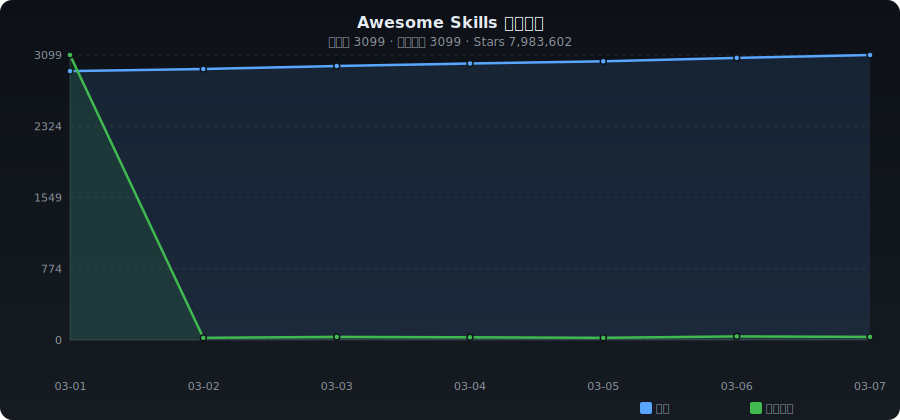

# ✨ Awesome Skills

[English](./README.md) | **中文**

> AI Agent Skills 精选集合 —— 自动收录 GitHub 上优质 Skills、Rules、MCP Servers、Prompts 等资源

   

---

## 📈 收录趋势

<p align="center"></p>

---

## 📊 分类统计

| 分类 | 数量 | 占比 |
|------|-----:|-----:|
| 🤖 AI & 机器学习 | 2204 | ███████████████████████ 71.1% |
| 🔌 MCP 服务 | 118 | █ 3.8% |
| 📏 Cursor Rules | 20 | █ 0.6% |
| 💬 提示词工程 | 121 | █ 3.9% |
| 🔧 开发工具 | 426 | ████ 13.7% |
| 🌐 Web 开发 | 34 | █ 1.1% |
| ☁️ 云服务 & DevOps | 17 | █ 0.5% |
| 🔐 安全 | 38 | █ 1.2% |
| 📊 数据处理 | 25 | █ 0.8% |
| ⚡ 自动化 & 工作流 | 16 | █ 0.5% |
| 🎨 UI / UX | 18 | █ 0.6% |
| 💰 金融 | 3 | █ 0.1% |
| 📦 其他 | 59 | █ 1.9% |

---

## 🔥 每日热门 (2026-03-07)

| # | 项目 | ⭐ | 📈 日增 | 描述 |
|:-:|------|---:|-------:|------|
| 1 | [openai/symphony](https://github.com/openai/symphony) | 8,290 | +1728 | 交响曲将项目工作转化为孤立的,自主执行运行, |
| 2 | [googleworkspace/cli](https://github.com/googleworkspace/cli) | 14,835 | +1627 | 谷歌工作空间CLI 一个命令行工具用于驱动,Gmail,日历,文件,聊天,管理员等.从谷歌发现服务动... |
| 3 | [affaan-m/everything-claude-code](https://github.com/affaan-m/everything-claude-code) | 63,876 | +1324 | 经纪人利用性能优化系统,技能,本能,记忆,安全,以及对克劳德代码,Codex,Cowork等领域的研... |
| 4 | [phuryn/pm-skills](https://github.com/phuryn/pm-skills) | 3,990 | +1296 | 总部技能市场:100多个代理技能,命令和插件从发现到策略,执行,推出和增长. |
| 5 | [VoltAgent/awesome-openclaw-skills](https://github.com/VoltAgent/awesome-openclaw-skills) | 30,231 | +944 | 5,400+技能从官方OpenClaw技能登记册中过和分类. |
| 6 | [shareAI-lab/learn-claude-code](https://github.com/shareAI-lab/learn-claude-code) | 22,994 | +901 | 是你需要的 - 一个像纳米克劳德代码的代理,从0到1构建 |
| 7 | [anthropics/skills](https://github.com/anthropics/skills) | 86,367 | +708 | Agent Skills公共代码库。 |
| 8 | [obra/superpowers](https://github.com/obra/superpowers) | 73,039 | +625 | 提供一个有效的代理技能框架和软件开发方法. |
| 9 | [twostraws/SwiftUI-Agent-Skill](https://github.com/twostraws/SwiftUI-Agent-Skill) | 885 | +574 | 对于克劳德代码,Codex和其他人工智能工具的SwiftUI代理技能. |
| 10 | [QwenLM/Qwen-Agent](https://github.com/QwenLM/Qwen-Agent) | 14,874 | +535 | Agent framework and applications built upon Qwen>=... |
| 11 | [anomalyco/opencode](https://github.com/anomalyco/opencode) | 117,657 | +518 | 开源编码代理。 |
| 12 | [sickn33/antigravity-awesome-skills](https://github.com/sickn33/antigravity-awesome-skills) | 21,262 | +457 | The Ultimate Collection of 900+ Agentic Skills for... |
| 13 | [shanraisshan/claude-code-best-practice](https://github.com/shanraisshan/claude-code-best-practice) | 12,163 | +415 | practice made claude perfect |
| 14 | [bytedance/deer-flow](https://github.com/bytedance/deer-flow) | 25,398 | +408 | 通过使用沙盒,记忆,工具,技能和副本,它可以处理不同层次的任务,可能需要几分钟到几个小时. |
| 15 | [x1xhlol/system-prompts-and-models-of-ai-tools](https://github.com/x1xhlol/system-prompts-and-models-of-ai-tools) | 129,181 | +396 | 完整增强代码、Claude Code、Cluely、CodeBuddy、Comet、Cursor、D... |
| 16 | [VoltAgent/awesome-agent-skills](https://github.com/VoltAgent/awesome-agent-skills) | 9,895 | +388 | Claude Code Skills and 380+ agent skills from offi... |
| 17 | [aidenybai/react-grab](https://github.com/aidenybai/react-grab) | 6,175 | +387 | Select context for coding agents directly from you... |
| 18 | [gsd-build/get-shit-done](https://github.com/gsd-build/get-shit-done) | 25,541 | +381 | 对于TÂCHES的Claude Code,一个轻量级而强大的超级提示,文本工程和基于规格的开发系统. |
| 19 | [Ed1s0nZ/CyberStrikeAI](https://github.com/Ed1s0nZ/CyberStrikeAI) | 1,802 | +375 | CyberStrikeAI is an AI-native security testing pla... |
| 20 | [farion1231/cc-switch](https://github.com/farion1231/cc-switch) | 24,968 | +355 | 一个跨平台桌面所有在一个助理工具,用于克劳德代码,Codex,OpenCode & Gemini C... |

---

## 📁 分类目录

- [🤖 AI & 机器学习](#ai-ml) (2204)
- [🔌 MCP 服务](#mcp) (118)
- [📏 Cursor Rules](#cursor-rules) (20)
- [💬 提示词工程](#prompts) (121)
- [🔧 开发工具](#dev-tools) (426)
- [🌐 Web 开发](#web) (34)
- [☁️ 云服务 & DevOps](#cloud) (17)
- [🔐 安全](#security) (38)
- [📊 数据处理](#data) (25)
- [⚡ 自动化 & 工作流](#automation) (16)
- [🎨 UI / UX](#ui-ux) (18)
- [💰 金融](#finance) (3)
- [📦 其他](#other) (59)

---

### <a id="ai-ml"></a>🤖 AI & 机器学习

| 项目 | ⭐ | 语言 | 描述 |
|------|---:|:----:|------|
| [openclaw/openclaw](https://github.com/openclaw/openclaw) | 241,485 | TypeScript | Your own personal AI assistant. Any OS. Any Platform. The lobster way.... |
| [Significant-Gravitas/AutoGPT](https://github.com/Significant-Gravitas/AutoGPT) | 182,108 | Python | AutoGPT is the vision of accessible AI for everyone, to use and to bui... |
| [f/prompts.chat](https://github.com/f/prompts.chat) | 150,430 | HTML | f.k.a. Awesome ChatGPT Prompts. Share, discover, and collect prompts f... |
| [f/awesome-chatgpt-prompts](https://github.com/f/prompts.chat) | 149,350 | HTML | f.k.a. Awesome ChatGPT Prompts. Share, discover, and collect prompts f... |
| [langflow-ai/langflow](https://github.com/langflow-ai/langflow) | 145,333 | Python | Langflow is a powerful tool for building and deploying AI-powered agen... |
| [langgenius/dify](https://github.com/langgenius/dify) | 130,747 | TypeScript | Production-ready platform for agentic workflow development. |
| [x1xhlol/system-prompts-and-models-of-ai-tools](https://github.com/x1xhlol/system-prompts-and-models-of-ai-tools) | 129,181 | - | FULL Augment Code, Claude Code, Cluely, CodeBuddy, Comet, Cursor, Devi... |
| [anomalyco/opencode](https://github.com/anomalyco/opencode) | 117,657 | TypeScript | The open source coding agent. |
| [Shubhamsaboo/awesome-llm-apps](https://github.com/Shubhamsaboo/awesome-llm-apps) | 100,291 | Python | Collection of awesome LLM apps with AI Agents and RAG using OpenAI, An... |
| [anthropics/skills](https://github.com/anthropics/skills) | 86,367 | Python | Public repository for Agent Skills |
| [modelcontextprotocol/servers](https://github.com/modelcontextprotocol/servers) | 80,406 | TypeScript | Model Context Protocol Servers |
| [browser-use/browser-use](https://github.com/browser-use/browser-use) | 79,238 | Python | 🌐 Make websites accessible for AI agents. Automate tasks online with e... |
| [nomic-ai/gpt4all](https://github.com/nomic-ai/gpt4all) | 77,163 | C++ | GPT4All: Run Local LLMs on Any Device. Open-source and available for c... |
| [anthropics/claude-code](https://github.com/anthropics/claude-code) | 74,863 | Shell | Claude Code is an agentic coding tool that lives in your terminal, und... |
| [obra/superpowers](https://github.com/obra/superpowers) | 73,039 | Shell | An agentic skills framework & software development methodology that wo... |
| [ansible/ansible](https://github.com/ansible/ansible) | 68,226 | Python | Ansible is a radically simple IT automation platform that makes your a... |
| [affaan-m/everything-claude-code](https://github.com/affaan-m/everything-claude-code) | 63,876 | JavaScript | The agent harness performance optimization system. Skills, instincts, ... |
| [openai/codex](https://github.com/openai/codex) | 63,657 | Rust | Lightweight coding agent that runs in your terminal |
| [OpenInterpreter/open-interpreter](https://github.com/openinterpreter/open-interpreter) | 62,470 | Python | A natural language interface for computers |
| [Mintplex-Labs/anything-llm](https://github.com/Mintplex-Labs/anything-llm) | 55,621 | JavaScript | The all-in-one Desktop & Docker AI application with built-in RAG, AI a... |
| [jeecgboot/JeecgBoot](https://github.com/jeecgboot/JeecgBoot) | 45,357 | Java | 【AI低代码平台】AI low-code platform empowers enterprises to quickly develop ... |
| [zhayujie/chatgpt-on-wechat](https://github.com/zhayujie/chatgpt-on-wechat) | 41,976 | Python | CowAgent是基于大模型的超级AI助理，能主动思考和任务规划、访问操作系统和外部资源、创造和执行Skills、拥有长期记忆并不断成长。同... |
| [ComposioHQ/awesome-claude-skills](https://github.com/ComposioHQ/awesome-claude-skills) | 41,571 | Python | A curated list of awesome Claude Skills, resources, and tools for cust... |
| [CherryHQ/cherry-studio](https://github.com/CherryHQ/cherry-studio) | 40,935 | TypeScript | AI productivity studio with smart chat, autonomous agents, and 300+ as... |
| [lm-sys/FastChat](https://github.com/lm-sys/FastChat) | 39,419 | Python | An open platform for training, serving, and evaluating large language ... |
| [PatrickJS/awesome-cursorrules](https://github.com/PatrickJS/awesome-cursorrules) | 38,300 | MDX | 📄  Configuration files that enhance Cursor AI editor experience with c... |
| [danny-avila/LibreChat](https://github.com/danny-avila/LibreChat) | 34,418 | TypeScript | Enhanced ChatGPT Clone: Features Agents, MCP, DeepSeek, Anthropic, AWS... |
| [anthropics/claude-cookbooks](https://github.com/anthropics/claude-cookbooks) | 33,775 | Jupyter Notebook | A collection of notebooks/recipes showcasing some fun and effective wa... |
| [thedotmack/claude-mem](https://github.com/thedotmack/claude-mem) | 33,253 | TypeScript | A Claude Code plugin that automatically captures everything Claude doe... |
| [TabbyML/tabby](https://github.com/TabbyML/tabby) | 32,995 | Rust | Self-hosted AI coding assistant |
| [khoj-ai/khoj](https://github.com/khoj-ai/khoj) | 32,694 | Python | Your AI second brain. Self-hostable. Get answers from the web or your ... |
| [alibaba/nacos](https://github.com/alibaba/nacos) | 32,692 | Java | an easy-to-use dynamic service discovery, configuration and service ma... |
| [block/goose](https://github.com/block/goose) | 32,573 | Rust | an open source, extensible AI agent that goes beyond code suggestions ... |
| [wshobson/agents](https://github.com/wshobson/agents) | 30,460 | Python | Intelligent automation and multi-agent orchestration for Claude Code |
| [tatsu-lab/stanford_alpaca](https://github.com/tatsu-lab/stanford_alpaca) | 30,271 | Python | Code and documentation to train Stanford's Alpaca models, and generate... |
| [VoltAgent/awesome-openclaw-skills](https://github.com/VoltAgent/awesome-openclaw-skills) | 30,231 | - | The awesome collection of OpenClaw skills. 5,400+ skills filtered and ... |
| [musistudio/claude-code-router](https://github.com/musistudio/claude-code-router) | 29,132 | TypeScript | Use Claude Code as the foundation for coding infrastructure, allowing ... |
| [Fission-AI/OpenSpec](https://github.com/Fission-AI/OpenSpec) | 28,289 | TypeScript | Spec-driven development (SDD) for AI coding assistants. |
| [ComposioHQ/composio](https://github.com/ComposioHQ/composio) | 27,311 | TypeScript | Composio powers 1000+ toolkits, tool search, context management, authe... |
| [hesreallyhim/awesome-claude-code](https://github.com/hesreallyhim/awesome-claude-code) | 26,682 | Python | A curated list of awesome skills, hooks, slash-commands, agent orchest... |

---

### <a id="mcp"></a>🔌 MCP 服务

| 项目 | ⭐ | 语言 | 描述 |
|------|---:|:----:|------|
| [google-gemini/gemini-cli](https://github.com/google-gemini/gemini-cli) | 96,048 | TypeScript | An open-source AI agent that brings the power of Gemini directly into ... |
| [punkpeye/awesome-mcp-servers](https://github.com/punkpeye/awesome-mcp-servers) | 82,412 | - | A collection of MCP servers. |
| [czlonkowski/n8n-mcp](https://github.com/czlonkowski/n8n-mcp) | 14,462 | TypeScript | A MCP for Claude Desktop / Claude Code / Windsurf / Cursor to build n8... |
| [modelcontextprotocol/registry](https://github.com/modelcontextprotocol/registry) | 6,521 | Go | A community driven registry service for Model Context Protocol (MCP) s... |
| [yzfly/Awesome-MCP-ZH](https://github.com/yzfly/Awesome-MCP-ZH) | 6,401 | - | MCP 资源精选， MCP指南，Claude MCP，MCP Servers, MCP Clients |
| [nanbingxyz/5ire](https://github.com/nanbingxyz/5ire) | 5,060 | TypeScript | 5ire is a cross-platform desktop AI assistant, MCP client. It compatib... |
| [getsentry/XcodeBuildMCP](https://github.com/getsentry/XcodeBuildMCP) | 4,589 | TypeScript | A Model Context Protocol (MCP) server and CLI that provides tools for ... |
| [wong2/awesome-mcp-servers](https://github.com/wong2/awesome-mcp-servers) | 3,707 | - | A curated list of Model Context Protocol (MCP) servers |
| [AmoyLab/Unla](https://github.com/AmoyLab/Unla) | 2,047 | TypeScript | 🧩 MCP Gateway - A lightweight gateway service that instantly transform... |
| [chatmcp/mcpso](https://github.com/chatmcp/mcpso) | 1,976 | TypeScript | directory for Awesome MCP Servers |
| [taylorwilsdon/google_workspace_mcp](https://github.com/taylorwilsdon/google_workspace_mcp) | 1,708 | Python | Control Gmail, Google Calendar, Docs, Sheets, Slides, Chat, Forms, Tas... |
| [GongRzhe/Office-PowerPoint-MCP-Server](https://github.com/GongRzhe/Office-PowerPoint-MCP-Server) | 1,558 | Python | A MCP (Model Context Protocol) server for PowerPoint manipulation usin... |
| [f/mcptools](https://github.com/f/mcptools) | 1,511 | Go | A command-line interface for interacting with MCP (Model Context Proto... |
| [designcomputer/mysql_mcp_server](https://github.com/designcomputer/mysql_mcp_server) | 1,150 | Python | A Model Context Protocol (MCP) server that enables secure interaction ... |
| [jaw9c/awesome-remote-mcp-servers](https://github.com/jaw9c/awesome-remote-mcp-servers) | 1,010 | - | Remote MCP Servers |
| [ref-tools/ref-tools-mcp](https://github.com/ref-tools/ref-tools-mcp) | 989 | TypeScript | Helping coding agents never make mistakes working with public or priva... |
| [mongodb-js/mongodb-mcp-server](https://github.com/mongodb-js/mongodb-mcp-server) | 941 | TypeScript | A Model Context Protocol server to connect to MongoDB databases and Mo... |
| [neo4j-contrib/mcp-neo4j](https://github.com/neo4j-contrib/mcp-neo4j) | 911 | Python | Neo4j Labs Model Context Protocol servers |
| [lgazo/drawio-mcp-server](https://github.com/lgazo/drawio-mcp-server) | 911 | TypeScript | Draw.io Model Context Protocol (MCP) Server |
| [alioshr/memory-bank-mcp](https://github.com/alioshr/memory-bank-mcp) | 874 | TypeScript | A Model Context Protocol (MCP) server implementation for remote memory... |
| [MobinX/awesome-mcp-list](https://github.com/MobinX/awesome-mcp-list) | 869 | - | A concise list for mcp servers |
| [negokaz/excel-mcp-server](https://github.com/negokaz/excel-mcp-server) | 864 | Go | A Model Context Protocol (MCP) server that reads and writes MS Excel d... |
| [nickclyde/duckduckgo-mcp-server](https://github.com/nickclyde/duckduckgo-mcp-server) | 859 | Python | A Model Context Protocol (MCP) server that provides web search capabil... |
| [jonigl/mcp-client-for-ollama](https://github.com/jonigl/mcp-client-for-ollama) | 561 | Python | A text-based user interface (TUI) client for interacting with MCP serv... |
| [TensorBlock/awesome-mcp-servers](https://github.com/TensorBlock/awesome-mcp-servers) | 558 | - | A comprehensive collection of Model Context Protocol (MCP) servers |
| [cyproxio/mcp-for-security](https://github.com/cyproxio/mcp-for-security) | 557 | TypeScript | MCP for Security: A collection of Model Context Protocol servers for p... |
| [MxIris-Reverse-Engineering/ida-mcp-server](https://github.com/MxIris-Reverse-Engineering/ida-mcp-server) | 525 | Python | A Model Context Protocol server for IDA |
| [miantiao-me/bm.md](https://github.com/miantiao-me/bm.md) | 519 | TypeScript | 更好用的 Markdown 排版助手｜一键适配微信公众号、网页与图片。 |
| [Softeria/ms-365-mcp-server](https://github.com/Softeria/ms-365-mcp-server) | 510 | TypeScript | A Model Context Protocol (MCP) server for interacting with Microsoft 3... |
| [dbt-labs/dbt-mcp](https://github.com/dbt-labs/dbt-mcp) | 502 | Python | A MCP (Model Context Protocol) server for interacting with dbt. |
| [PV-Bhat/vibe-check-mcp-server](https://github.com/PV-Bhat/vibe-check-mcp-server) | 479 | TypeScript | Vibe Check is a tool that provides mentor-like feedback to AI Agents, ... |
| [domdomegg/airtable-mcp-server](https://github.com/domdomegg/airtable-mcp-server) | 428 | TypeScript | 🗂️🤖 Airtable Model Context Protocol Server, for allowing AI systems to... |
| [better-auth/better-icons](https://github.com/better-auth/better-icons) | 406 | TypeScript | Skill and MCP server for searching and retrieving icons |
| [Cranot/roam-code](https://github.com/Cranot/roam-code) | 399 | Python | Architectural intelligence layer for AI coding agents. Structural grap... |
| [1mcp-app/agent](https://github.com/1mcp-app/agent) | 389 | TypeScript | A unified Model Context Protocol server implementation that aggregates... |
| [graphlit/graphlit-mcp-server](https://github.com/graphlit/graphlit-mcp-server) | 372 | TypeScript | Model Context Protocol (MCP) Server for Graphlit Platform |
| [adhikasp/mcp-reddit](https://github.com/adhikasp/mcp-reddit) | 361 | Python | A Model Context Protocol (MCP) server that provides tools for fetching... |
| [afrise/MCPSharp](https://github.com/afrise/MCPSharp) | 361 | C# | MCPSharp is a .NET library that helps you build Model Context Protocol... |
| [InditexTech/mcp-teams-server](https://github.com/InditexTech/mcp-teams-server) | 357 | Python | An MCP (Model Context Protocol) server implementation for Microsoft Te... |
| [awslabs/run-model-context-protocol-servers-with-aws-lambda](https://github.com/awslabs/run-model-context-protocol-servers-with-aws-lambda) | 350 | Python | Run existing Model Context Protocol (MCP) stdio-based servers in AWS L... |

---

### <a id="cursor-rules"></a>📏 Cursor Rules

| 项目 | ⭐ | 语言 | 描述 |
|------|---:|:----:|------|
| [grapeot/devin.cursorrules](https://github.com/grapeot/devin.cursorrules) | 5,956 | Python | Magic to turn Cursor/Windsurf as 90% of Devin |
| [sanjeed5/awesome-cursor-rules-mdc](https://github.com/sanjeed5/awesome-cursor-rules-mdc) | 3,350 | Python | Curated list of awesome Cursor Rules .mdc files |
| [kinopeee/cursorrules](https://github.com/kinopeee/cursorrules) | 1,127 | - |  |
| [matank001/cursor-security-rules](https://github.com/matank001/cursor-security-rules) | 364 | - | This repository contains Cursor Security Rules designed to improve the... |
| [skindhu/harmony-cursor-rules](https://github.com/skindhu/harmony-cursor-rules) | 95 | Python | 🎯 基于AI技术自动提取华为HarmonyOS官方最佳实践，生成专业的CursorRules规则文件。解决主流AI模型缺乏HarmonyOS... |
| [ivangrynenko/cursorrules](https://github.com/ivangrynenko/cursorrules) | 75 | Shell | A set of cursor rules for Cursor AI IDE that support PHP, Python, Java... |
| [beilunyang/vscode-cursor-rules](https://github.com/beilunyang/vscode-cursor-rules) | 49 | TypeScript | An extension for Cursor and VSCode that lets you pull .cursorrules fil... |
| [paulpham157/paul-s-cursor-rules](https://github.com/paulpham157/paul-s-cursor-rules) | 34 | - | Chia sẻ settings Cursor AI IDE |
| [barisercan/cursorrules](https://github.com/barisercan/cursorrules) | 34 | - | Cursor rules that works |
| [link2004/cursorrules-nextjs](https://github.com/link2004/cursorrules-nextjs) | 27 | - |  |
| [fleXRPL/cursor-rules-dynamic](https://github.com/fleXRPL/cursor-rules-dynamic) | 23 | TypeScript | A powerful VSCode extension for dynamic management and analysis of .cu... |
| [HaiDong-Once/cursor-rules-collection](https://github.com/HaiDong-Once/cursor-rules-collection) | 23 | - | 一套全面的 Cursor Rules 集合，用于前端开发、数据分析、爬虫和其他开发实践。这些规则可在各种项目中轻松导入和使用，提高开发效率和... |
| [ryanrawlingswang/cursor-rules](https://github.com/ryanrawlingswang/cursor-rules) | 17 | - | A collection of battle-tested Cursor AI rules that enable rapid, high-... |
| [nedcodes-ok/cursorrules-collection](https://github.com/nedcodes-ok/cursorrules-collection) | 15 | Shell | 110+ tested .mdc and .cursorrules files for Cursor AI. Validate with c... |
| [regenrek/cursorrules-vs-code-extensions](https://github.com/regenrek/cursorrules-vs-code-extensions) | 14 | TypeScript | ✨ A simple extension that allows you to search and add .cursorrules li... |
| [peternixey/cursorrules](https://github.com/peternixey/cursorrules) | 13 | - | My (current) cursorrules folder |
| [TideTree/awesome-cursor-rules-mdc-zh](https://github.com/TideTree/awesome-cursor-rules-mdc-zh) | 12 | JavaScript | 🧠 Awesome Cursor Rules 中文翻译版 |
| [Zenobia000/CursorGod-cursorrules-buff](https://github.com/Zenobia000/CursorGod-cursorrules-buff) | 11 | Python | 神奇海螺 cursorrules 阿拉丁神燈想要甚麼許願就有 |
| [blodyle/cursorrules](https://github.com/blodyle/cursorrules) | 10 | HTML | Small repo with some guidelines to create a .cursorrules file |
| [lgnorant-lu/CorLings](https://github.com/lgnorant-lu/CorLings) | 10 | Python | 一份关于Cursor Rules的相关文档教程;A tutorial about coding with structed rules(Cu... |

---

### <a id="prompts"></a>💬 提示词工程

| 项目 | ⭐ | 语言 | 描述 |
|------|---:|:----:|------|
| [PlexPt/awesome-chatgpt-prompts-zh](https://github.com/PlexPt/awesome-chatgpt-prompts-zh) | 58,581 | - | ChatGPT 中文调教指南。各种场景使用指南。学习怎么让它听你的话。 |
| [github/awesome-copilot](https://github.com/github/awesome-copilot) | 24,016 | JavaScript | Community-contributed instructions, prompts, and configurations to hel... |
| [powerline/powerline](https://github.com/powerline/powerline) | 14,713 | Python | Powerline is a statusline plugin for vim, and provides statuslines and... |
| [ZeroLu/awesome-nanobanana-pro](https://github.com/ZeroLu/awesome-nanobanana-pro) | 9,279 | - | 🚀 An awesome list of curated Nano Banana pro prompts and examples. You... |
| [YouMind-OpenLab/awesome-nano-banana-pro-prompts](https://github.com/YouMind-OpenLab/awesome-nano-banana-pro-prompts) | 8,546 | TypeScript | 🍌 World's largest Nano Banana Pro prompt library — 10,000+ curated pro... |
| [ai-boost/awesome-prompts](https://github.com/ai-boost/awesome-prompts) | 7,385 | - | Curated list of chatgpt prompts from the top-rated GPTs in the GPTs St... |
| [jorgebucaran/awsm.fish](https://github.com/jorgebucaran/awsm.fish) | 4,875 | - | A curation of prompts, plugins & other Fish treasures 🐚💎 |
| [L1Xu4n/Awesome-ChatGPT-prompts-ZH_CN](https://github.com/L1Xu4n/Awesome-ChatGPT-prompts-ZH_CN) | 3,137 | - | 如何将ChatGPT调教成一只猫娘 |
| [google-labs-code/jules-awesome-list](https://github.com/google-labs-code/jules-awesome-list) | 2,859 | - | Some awesome prompts for Jules Agent |
| [glidea/banana-prompt-quicker](https://github.com/glidea/banana-prompt-quicker) | 2,224 | JavaScript | 🍌Awesome Prompts; Nano Banana；Banana Pro; Gemini；AI Studio；Prompt Quic... |
| [NeekChaw/awesome-prompt](https://github.com/NeekChaw/awesome-prompt) | 1,154 | GCC Machine Description | 让你一眼惊艳的prompt |
| [Bhartendu-Kumar/rules_template](https://github.com/Bhartendu-Kumar/rules_template) | 1,062 | - | If using CLINE/RooCode/Cursor/Windsurf Setup these rules. Usable for n... |
| [serenakeyitan/awesome-notebookLM-prompts](https://github.com/serenakeyitan/awesome-notebookLM-prompts) | 982 | - | A curated collection of the strongest NotebookLM slide prompts sourced... |
| [ttengwang/Awesome_Prompting_Papers_in_Computer_Vision](https://github.com/ttengwang/Awesome_Prompting_Papers_in_Computer_Vision) | 924 | - | A curated list of prompt-based paper in computer vision and vision-lan... |
| [browser-use/awesome-prompts](https://github.com/browser-use/awesome-prompts) | 898 | - | Table of awesome Browser Use prompts |
| [skills-directory/skill-codex](https://github.com/skills-directory/skill-codex) | 764 | - | A claude code skill to delegate prompts to codex |
| [xianyu110/awesome-nanobananapro-prompts](https://github.com/xianyu110/awesome-nanobananapro-prompts) | 675 | HTML | Nano Banana Pro 全网最全提示词整理 |
| [ZeroLu/awesome-seedance](https://github.com/ZeroLu/awesome-seedance) | 656 | - | The ultimate collection of high-fidelity Seedance 2.0 prompts and Seed... |
| [dongshuyan/Awesome-Prompts](https://github.com/dongshuyan/Awesome-Prompts) | 641 | - | 分享一下自创以及打野得到的各种优质prompt |
| [ZeroLu/awesome-gemini-ai](https://github.com/ZeroLu/awesome-gemini-ai) | 615 | - | The ultimate collection of Awesome Gemini Prompts, use cases, and exam... |
| [ImgEdify/Awesome-GPT4o-Image-Prompts](https://github.com/ImgEdify/Awesome-GPT4o-Image-Prompts) | 533 | HTML | 📚 GPT4o Prompts Dictionary | Curated Collection of AI Image Generation... |
| [JindongGu/Awesome-Prompting-on-Vision-Language-Model](https://github.com/JindongGu/Awesome-Prompting-on-Vision-Language-Model) | 509 | - | This repo lists relevant papers summarized in our survey paper:  A Sys... |
| [songguoxs/awesome-video-prompts](https://github.com/songguoxs/awesome-video-prompts) | 454 | - | awesome veo3/veo3.1/kling/hailuo video prompts |
| [songtianlun/awesome-prompts](https://github.com/songtianlun/awesome-prompts) | 441 | HTML | Awesome Prompts, Nano Banana, Nano Banana Pro, Sora2, GPT-4o, gpt-imag... |
| [WxxShirley/Awesome-Graph-Prompt](https://github.com/WxxShirley/Awesome-Graph-Prompt) | 422 | - | Awesome Papers About Performing Prompting On Graphs |
| [YouMind-OpenLab/awesome-gemini-3-prompts](https://github.com/YouMind-OpenLab/awesome-gemini-3-prompts) | 421 | TypeScript | ♊ 50+ selected Gemini prompts with images, multilingual support, and i... |
| [langgptai/awesome-gemini-prompts](https://github.com/langgptai/awesome-gemini-prompts) | 419 | - | Gemini Prompts, Gemini 3 Prompts, jailbreak, LLM Prompts, LangGPT —— b... |
| [ora-sh/Awesome-GPT4-Prompts](https://github.com/ora-sh/Awesome-GPT4-Prompts) | 372 | - | A collection of awesome GPT4 prompts |
| [langgptai/Awesome-Multimodal-Prompts](https://github.com/langgptai/Awesome-Multimodal-Prompts) | 279 | - | Prompts of GPT-4V & DALL-E3 to full utilize the multi-modal ability. G... |
| [Jermic/awesome-aiart-pics-prompts](https://github.com/Jermic/awesome-aiart-pics-prompts) | 274 | - | 🎨 精选 3000+ Gemini Nano Banana Pro 高质量提示词与生成案例 | 涵盖摄影、设计、艺术、营销等多领域 | 双语... |
| [YouMind-OpenLab/awesome-seedance-2-prompts](https://github.com/YouMind-OpenLab/awesome-seedance-2-prompts) | 220 | TypeScript | 🎬 400+ curated Seedance 2.0 video generation prompts — cinematic, anim... |
| [zhangchenchen/awesome_sora2_prompt](https://github.com/zhangchenchen/awesome_sora2_prompt) | 219 | - | Awesome Sora2 Prompt |
| [camsong/chatgpt-engineer-prompts](https://github.com/camsong/chatgpt-engineer-prompts) | 168 | - | Awesome ChatGPT prompts for engineers😇 |
| [tallesborges/agentic-system-prompts](https://github.com/tallesborges/agentic-system-prompts) | 154 | Jinja | A curated collection of system prompts and tool definitions from produ... |
| [kesslernity/awesome-microsoft-copilot-prompts](https://github.com/kesslernity/awesome-microsoft-copilot-prompts) | 154 | - | The definitive Microsoft 365 Copilot prompt library for business teams... |
| [yunwei37/Awesome-Prompt-Engineering-ZH-CN](https://github.com/yunwei37/Awesome-Prompt-Engineering-ZH-CN) | 152 | Python | 这个资源库包含了为 Prompt 工程手工整理的资源中文清单，重点是GPT、ChatGPT、PaLM 等（自动持续更新） |
| [Vipuser2023/chatgpt-prompts-chinese](https://github.com/Vipuser2023/chatgpt-prompts-chinese) | 137 | - | 极好的ChatGPT中文提示命令，对标awesome-chatgpt-prompts，命令包含awesome-chatgpt-prompts... |
| [ZizheRuan/awesome-nanobanana2](https://github.com/ZizheRuan/awesome-nanobanana2) | 133 | Python | A curated collection of 🍌Nano Banana 2 prompts and image examples. Nan... |
| [aminblm/awesome-chatgpt-content-creation-prompts](https://github.com/aminblm/awesome-chatgpt-content-creation-prompts) | 125 | HTML | This repo includes ChatGPT content creation prompt curation to use Cha... |
| [dukeluo/awesome-awesome-prompts](https://github.com/dukeluo/awesome-awesome-prompts) | 115 | - | An awesome list for collecting awesome lists related to prompt enginee... |

---

### <a id="dev-tools"></a>🔧 开发工具

| 项目 | ⭐ | 语言 | 描述 |
|------|---:|:----:|------|
| [Developer-Y/cs-video-courses](https://github.com/Developer-Y/cs-video-courses) | 75,355 | - | List of Computer Science courses with video lectures. |
| [cline/cline](https://github.com/cline/cline) | 58,727 | TypeScript | Autonomous coding agent right in your IDE, capable of creating/editing... |
| [slidevjs/slidev](https://github.com/slidevjs/slidev) | 44,558 | TypeScript | Presentation Slides for Developers |
| [remotion-dev/remotion](https://github.com/remotion-dev/remotion) | 38,231 | TypeScript | 🎥      Make videos programmatically with React |
| [ToolJet/ToolJet](https://github.com/ToolJet/ToolJet) | 37,554 | JavaScript | ToolJet is the open-source foundation of ToolJet AI - the AI-native pl... |
| [PostHog/posthog](https://github.com/PostHog/posthog) | 31,918 | Python | 🦔 PostHog is an all-in-one developer platform for building successful ... |
| [ChromeDevTools/chrome-devtools-mcp](https://github.com/ChromeDevTools/chrome-devtools-mcp) | 27,902 | TypeScript | Chrome DevTools for coding agents |
| [gsd-build/get-shit-done](https://github.com/gsd-build/get-shit-done) | 25,541 | JavaScript | A light-weight and powerful meta-prompting, context engineering and sp... |
| [farion1231/cc-switch](https://github.com/farion1231/cc-switch) | 24,968 | TypeScript | A cross-platform desktop All-in-One assistant tool for Claude Code, Co... |
| [modelcontextprotocol/python-sdk](https://github.com/modelcontextprotocol/python-sdk) | 22,003 | Python | The official Python SDK for Model Context Protocol servers and clients |
| [mikeroyal/Self-Hosting-Guide](https://github.com/mikeroyal/Self-Hosting-Guide) | 18,850 | Dockerfile | Self-Hosting Guide. Learn all about  locally hosting (on premises & pr... |
| [Kilo-Org/kilocode](https://github.com/Kilo-Org/kilocode) | 16,339 | TypeScript | Kilo is the all-in-one agentic engineering platform. Build, ship, and ... |
| [plandex-ai/plandex](https://github.com/plandex-ai/plandex) | 15,058 | Go | Open source AI coding agent. Designed for large projects and real worl... |
| [anthropics/claude-quickstarts](https://github.com/anthropics/claude-quickstarts) | 14,924 | Python | A collection of projects designed to help developers quickly get start... |
| [muratcankoylan/Agent-Skills-for-Context-Engineering](https://github.com/muratcankoylan/Agent-Skills-for-Context-Engineering) | 13,536 | Python | A comprehensive collection of Agent Skills for context engineering, mu... |
| [modelcontextprotocol/typescript-sdk](https://github.com/modelcontextprotocol/typescript-sdk) | 11,777 | TypeScript | The official TypeScript SDK for Model Context Protocol servers and cli... |
| [ryoppippi/ccusage](https://github.com/ryoppippi/ccusage) | 11,302 | TypeScript | A CLI tool for analyzing Claude Code/Codex CLI usage from local JSONL ... |
| [tobi/qmd](https://github.com/tobi/qmd) | 11,172 | TypeScript | mini cli search engine for your docs, knowledge bases, meeting notes, ... |
| [abhigyanpatwari/GitNexus](https://github.com/abhigyanpatwari/GitNexus) | 10,645 | TypeScript | GitNexus: The Zero-Server Code Intelligence Engine -       GitNexus is... |
| [faisalman/ua-parser-js](https://github.com/faisalman/ua-parser-js) | 10,072 | JavaScript | UAParser.js - The Essential Web Development Tool for User-Agent Detect... |
| [krillinai/KrillinAI](https://github.com/krillinai/KrillinAI) | 9,680 | Go | Video translation and dubbing tool powered by LLMs. The video translat... |
| [github/copilot-cli](https://github.com/github/copilot-cli) | 9,127 | Shell | GitHub Copilot CLI brings the power of Copilot coding agent directly t... |
| [sweepai/sweep](https://github.com/sweepai/sweep) | 7,641 | Jupyter Notebook | Sweep: AI coding assistant for JetBrains |
| [kreuzberg-dev/kreuzberg](https://github.com/kreuzberg-dev/kreuzberg) | 6,385 | HTML | A polyglot document intelligence framework with a Rust core. Extract t... |
| [Klavis-AI/klavis](https://github.com/Klavis-AI/klavis) | 5,653 | Python | Klavis AI (YC X25):  MCP integration platforms that let AI agents use ... |
| [superset-sh/superset](https://github.com/superset-sh/superset) | 5,425 | TypeScript | IDE for the AI Agents Era - Run an army of Claude Code, Codex, etc. on... |
| [executeautomation/mcp-playwright](https://github.com/executeautomation/mcp-playwright) | 5,281 | TypeScript | Playwright Model Context Protocol Server - Tool to automate Browsers a... |
| [aipotheosis-labs/aci](https://github.com/aipotheosis-labs/aci) | 4,726 | Python | ACI.dev is the open source tool-calling platform that hooks up 600+ to... |
| [sirmalloc/ccstatusline](https://github.com/sirmalloc/ccstatusline) | 4,541 | TypeScript | 🚀 Beautiful highly customizable statusline for Claude Code CLI with po... |
| [ykdojo/claude-code-tips](https://github.com/ykdojo/claude-code-tips) | 4,234 | JavaScript | 45 tips for getting the most out of Claude Code, from basics to advanc... |
| [Pimzino/spec-workflow-mcp](https://github.com/Pimzino/spec-workflow-mcp) | 3,960 | TypeScript | A Model Context Protocol (MCP) server that provides structured spec-dr... |
| [opensumi/core](https://github.com/opensumi/core) | 3,607 | TypeScript | A framework helps you quickly build AI Native IDE products. MCP Client... |
| [jamesmurdza/awesome-ai-devtools](https://github.com/jamesmurdza/awesome-ai-devtools) | 3,595 | - | Curated list of AI-powered developer tools. |
| [smallcloudai/refact](https://github.com/smallcloudai/refact) | 3,512 | Rust | AI Agent that handles engineering tasks end-to-end: integrates with de... |
| [entireio/cli](https://github.com/entireio/cli) | 3,402 | Go | Entire is a new developer platform that hooks into your git workflow t... |
| [NAalytics/Assemblies-of-putative-SARS-CoV2-spike-encoding-mRNA-sequences-for-vaccines-BNT-162b2-and-mRNA-1273](https://github.com/NAalytics/Assemblies-of-putative-SARS-CoV2-spike-encoding-mRNA-sequences-for-vaccines-BNT-162b2-and-mRNA-1273) | 3,361 | - | RNA vaccines have become a key tool in moving forward through the chal... |
| [fengshao1227/ccg-workflow](https://github.com/fengshao1227/ccg-workflow) | 2,967 | Go | 多模型协作开发工具集 - 基于 Claude Code CLI，整合 Codex/Gemini 后端能力，提供智能路由、代码审查、Git 工... |
| [hacksysteam/HackSysExtremeVulnerableDriver](https://github.com/hacksysteam/HackSysExtremeVulnerableDriver) | 2,953 | C | HackSys Extreme Vulnerable Driver (HEVD) - Windows & Linux |
| [cirosantilli/china-dictatorship](https://github.com/cirosantilli/china-dictatorship) | 2,874 | HTML | 反中共政治宣传库。Anti Chinese government propaganda. 住在中国真名用户的网友请别给星星，不然你要被警察请... |
| [davepoon/buildwithclaude](https://github.com/davepoon/buildwithclaude) | 2,547 | TypeScript | A single hub to find Claude Skills, Agents, Commands, Hooks, Plugins, ... |

---

### <a id="web"></a>🌐 Web 开发

| 项目 | ⭐ | 语言 | 描述 |
|------|---:|:----:|------|
| [sindresorhus/awesome](https://github.com/sindresorhus/awesome) | 441,494 | - | 😎 Awesome lists about all kinds of interesting topics |
| [leonardomso/33-js-concepts](https://github.com/leonardomso/33-js-concepts) | 66,263 | JavaScript | 📜 33 JavaScript concepts every developer should know. |
| [zarazhangrui/frontend-slides](https://github.com/zarazhangrui/frontend-slides) | 8,553 | - | Create beautiful slides on the web using Claude's frontend skills |
| [TommyLemon/APIAuto](https://github.com/TommyLemon/APIAuto) | 2,177 | JavaScript | ☔ 敏捷开发最强大易用的接口工具，机器学习零代码测试与 AI 问答、生成代码与静态检查、生成文档与光标悬浮注释，腾讯、华为、SHEIN、传音... |
| [InsForge/InsForge](https://github.com/InsForge/InsForge) | 1,928 | TypeScript | The backend built for agentic development. AI-native Supabase alternat... |
| [rapid7/hackazon](https://github.com/rapid7/hackazon) | 1,019 | HTML | A modern vulnerable web app |
| [stamparm/DSVW](https://github.com/stamparm/DSVW) | 857 | Python | Damn Small Vulnerable Web |
| [AgnosticUI/agnosticui](https://github.com/AgnosticUI/agnosticui) | 779 | TypeScript | AgnosticUI Local (v2) is a CLI-based UI component library that copies ... |
| [angular/web-codegen-scorer](https://github.com/angular/web-codegen-scorer) | 688 | TypeScript | Web Codegen Scorer is a tool for evaluating the quality of web code ge... |
| [snoopysecurity/dvws](https://github.com/snoopysecurity/dvws) | 457 | PHP | Damn Vulnerable Web Services is an insecure web application with multi... |
| [evmts/tevm-monorepo](https://github.com/evmts/tevm-monorepo) | 436 | TypeScript | An Ethereum Node built to run in Browser, Bun, Deno, and Node.js |
| [adamdoupe/WackoPicko](https://github.com/adamdoupe/WackoPicko) | 346 | PHP | WackoPicko is a vulnerable web application used to test web applicatio... |
| [ythx-101/x-tweet-fetcher](https://github.com/ythx-101/x-tweet-fetcher) | 344 | Python | 🦞 Fetch tweets and replies from X/Twitter without login or API keys. O... |
| [CommE2E/comm](https://github.com/CommE2E/comm) | 324 | JavaScript | Comm is an E2E-encrypted, open source messaging app for communities. |
| [onepointAI/onepoint](https://github.com/onepointAI/onepoint) | 320 | TypeScript | An AI assistant tool that integrates coding, writing, and reading func... |
| [king04aman/All-In-One-Python-Projects](https://github.com/king04aman/All-In-One-Python-Projects) | 311 | Python | A huge collection of awesome beginner-friendly Python projects startin... |
| [HoangNguyen0403/agent-skills-standard](https://github.com/HoangNguyen0403/agent-skills-standard) | 288 | TypeScript | A collection of Agent Skills Standard and Best Practice for Programmin... |
| [CSPF-Founder/JavaVulnerableLab](https://github.com/CSPF-Founder/JavaVulnerableLab) | 270 | Java | Vulnerable Java based Web Application |
| [commixproject/commix-testbed](https://github.com/commixproject/commix-testbed) | 181 | PHP | A collection of web pages, vulnerable to command injection flaws |
| [LessUp/awesome-cursorrules-zh](https://github.com/LessUp/awesome-cursorrules-zh) | 121 | Python | 💻✨专为中文开发者优化的 Cursor AI 编程规则集合 |
| [liyupi/yupi-hot-monitor](https://github.com/liyupi/yupi-hot-monitor) | 92 | TypeScript | 2026 年编程导航 AI 编程实战新项目，基于 Node.js + Express + React + OpenRouter 的 AI 热... |
| [liyupi/github-global](https://github.com/liyupi/github-global) | 80 | TypeScript | 2026 年编程导航 AI 编程实战新项目，基于 Next.js 15 + GitHub App + OpenRouter 的 GitHub... |
| [melonlee/Sidonie](https://github.com/melonlee/Sidonie) | 62 | TypeScript | 将 MCP Server、REST API、OpenAPI 一键转换为 Claude Skill |
| [thinakaranmanokaran/clean-n-cut](https://github.com/thinakaranmanokaran/clean-n-cut) | 57 | TypeScript | A simple tool 🖼️ that removes image backgrounds automatically using AI... |
| [Tommertom/awesome-ionic-mcp](https://github.com/Tommertom/awesome-ionic-mcp) | 36 | TypeScript | An Awesome MCP Server to help building mobile apps in React/Vue/Angula... |
| [HamzaAmir97/saas_ai_website_builder](https://github.com/HamzaAmir97/saas_ai_website_builder) | 34 | TypeScript | Codey is an  AI Website Builder and AI-powered platform that lets user... |
| [black-forest-labs/skills](https://github.com/black-forest-labs/skills) | 32 | TypeScript | Official skills from Black Forest Labs for FLUX image generation model... |
| [VitoMedlej/free-developer-portfolio-template](https://github.com/VitoMedlej/free-developer-portfolio-template) | 30 | TypeScript | ✨A free awesome personal portfolio template for software engineers to ... |
| [firecrawl/firecrawl-claude-plugin](https://github.com/firecrawl/firecrawl-claude-plugin) | 24 | - | Firecrawl plugin for Claude Code - web scraping and crawling |
| [sgcarstrends/backend](https://github.com/sgcarstrends/sgcarstrends) | 19 | TypeScript | Monorepo for SG Cars Trends backend services |
| [abczsl520/bug-audit-skill](https://github.com/abczsl520/bug-audit-skill) | 18 | - | OpenClaw skill: Dynamic bug audit for Node.js web projects (games, dat... |
| [silentsignal/damn-vulnerable-stateful-web-app](https://github.com/silentsignal/damn-vulnerable-stateful-web-app) | 14 | PHP | Short and simple vulnerable PHP web application that naïve scanners fo... |
| [dobin/SentinelTestbed](https://github.com/dobin/SentinelTestbed) | 11 | PHP | Vulnerable web site. Used to test sentinel features. |
| [chends888/coa-calculator](https://github.com/chends888/coa-calculator) | 10 | JavaScript | Curse Of Aros Skills Calculator |

---

### <a id="cloud"></a>☁️ 云服务 & DevOps

| 项目 | ⭐ | 语言 | 描述 |
|------|---:|:----:|------|
| [Orange-Cyberdefense/GOAD](https://github.com/Orange-Cyberdefense/GOAD) | 7,497 | PowerShell | game of active directory |
| [antonbabenko/terraform-skill](https://github.com/antonbabenko/terraform-skill) | 1,285 | - | The Claude Agent Skill for Terraform and OpenTofu - testing, modules, ... |
| [ine-labs/AzureGoat](https://github.com/ine-labs/AzureGoat) | 917 | Python | AzureGoat : A Damn Vulnerable Azure Infrastructure |
| [dmmulroy/cloudflare-skill](https://github.com/dmmulroy/cloudflare-skill) | 704 | Shell |  |
| [ClickHouse/agent-skills](https://github.com/ClickHouse/agent-skills) | 343 | JavaScript | The official Agent Skills for ClickHouse and ClickHouse Cloud |
| [hemanth/paws-on-mcp](https://github.com/hemanth/paws-on-mcp) | 331 | Python | A comprehensive Model Context Protocol (MCP) server implementing the l... |
| [zxkane/aws-skills](https://github.com/zxkane/aws-skills) | 196 | Shell | Claude Agent Skills for AWS |
| [Fimeg/NetworkChronicles](https://github.com/Fimeg/NetworkChronicles) | 189 | JavaScript | NetworkChronicles - a gamified Linux learning system that documents yo... |
| [aws-solutions-library-samples/guidance-for-deploying-model-context-protocol-servers-on-aws](https://github.com/aws-solutions-library-samples/guidance-for-deploying-model-context-protocol-servers-on-aws) | 141 | TypeScript | This Guidance demonstrates how to securely run Model Context Protocol ... |
| [jonathan-vella/azure-agentic-infraops](https://github.com/jonathan-vella/azure-agentic-infraops) | 140 | Python | Agentic InfraOps transforms Azure deployments for IT Pros. Using GitHu... |
| [Spico197/Humback](https://github.com/Spico197/Humpback) | 137 | Python | 🐋 An unofficial implementation of Self-Alignment with Instruction Back... |
| [facebookresearch/motif](https://github.com/facebookresearch/motif) | 134 | Python | Intrinsic Motivation from Artificial Intelligence Feedback |
| [icoz69/StableLLAVA](https://github.com/icoz69/StableLLAVA) | 95 | Python | Official repo for StableLLAVA |
| [WagnerAgent/awesome-mcp-servers-devops](https://github.com/WagnerAgent/awesome-mcp-servers-devops) | 92 | - | A curated, DevOps-focused list of Model Context Protocol (MCP) servers... |
| [blencorp/claude-code-kit](https://github.com/blencorp/claude-code-kit) | 65 | Shell | Claude Code infrastructure with auto-activating skills and framework-s... |
| [terramate-io/agent-skills](https://github.com/terramate-io/agent-skills) | 26 | JavaScript | Agent skills and Claude Code for Terraform, OpenTofu, and Terramate sp... |
| [win4r/openclaw-remote-minimax-setup-skill](https://github.com/win4r/openclaw-remote-minimax-setup-skill) | 24 | - | Reusable OpenClaw skill for remote Linux deployment with MiniMax M2.1 ... |

---

### <a id="security"></a>🔐 安全

| 项目 | ⭐ | 语言 | 描述 |
|------|---:|:----:|------|
| [swisskyrepo/PayloadsAllTheThings](https://github.com/swisskyrepo/PayloadsAllTheThings) | 75,610 | Python | A list of useful payloads and bypass for Web Application Security and ... |
| [digininja/DVWA](https://github.com/digininja/DVWA) | 12,657 | PHP | Damn Vulnerable Web Application (DVWA) |
| [S1ckB0y1337/Active-Directory-Exploitation-Cheat-Sheet](https://github.com/S1ckB0y1337/Active-Directory-Exploitation-Cheat-Sheet) | 6,501 | - | A cheat sheet that contains common enumeration and attack methods for ... |
| [RPISEC/MBE](https://github.com/RPISEC/MBE) | 5,937 | C | Course materials for Modern Binary Exploitation by RPISEC |
| [rapid7/metasploitable3](https://github.com/rapid7/metasploitable3) | 5,457 | HTML | Metasploitable3 is a VM that is built from the ground up with a large ... |
| [meta-llama/PurpleLlama](https://github.com/meta-llama/PurpleLlama) | 4,052 | Python | Set of tools to assess and improve LLM security. |
| [RPISEC/Malware](https://github.com/RPISEC/Malware) | 4,002 | - | Course materials for Malware Analysis by RPISEC |
| [trailofbits/skills](https://github.com/trailofbits/skills) | 3,369 | Python | Trail of Bits Claude Code skills for security research, vulnerability ... |
| [kite-org/kite](https://github.com/kite-org/kite) | 2,303 | TypeScript | 🪁 A lightweight, modern Kubernetes dashboard that unifies multi-cluste... |
| [Ed1s0nZ/CyberStrikeAI](https://github.com/Ed1s0nZ/CyberStrikeAI) | 1,802 | Go | CyberStrikeAI is an AI-native security testing platform built in Go. I... |
| [s4n7h0/xvwa](https://github.com/s4n7h0/xvwa) | 1,744 | PHP | XVWA is a badly coded web application written in PHP/MySQL that helps ... |
| [tmylla/Awesome-LLM4Cybersecurity](https://github.com/tmylla/Awesome-LLM4Cybersecurity) | 1,242 | - | An overview of LLMs for cybersecurity. |
| [kenryu42/claude-code-safety-net](https://github.com/kenryu42/claude-code-safety-net) | 1,116 | TypeScript | A Claude Code plugin that acts as a safety net, catching destructive g... |
| [payatu/diva-android](https://github.com/payatu/diva-android) | 1,090 | Java | DIVA Android - Damn Insecure and vulnerable App for Android |
| [FuzzingLabs/fuzzforge_ai](https://github.com/FuzzingLabs/fuzzforge_ai) | 756 | Python | AI-powered workflow automation and AI Agents platform for AppSec, Fuzz... |
| [BrownFineSecurity/iothackbot](https://github.com/BrownFineSecurity/iothackbot) | 670 | Python | IoT HackBot: A collection of Claude Skills and custom tooling for hybr... |
| [prompt-security/clawsec](https://github.com/prompt-security/clawsec) | 594 | JavaScript | A complete security skill suite for OpenClaw's and NanoClaw agents (an... |
| [cr0hn/vulnerable-node](https://github.com/cr0hn/vulnerable-node) | 484 | JavaScript | A very vulnerable web site written in NodeJS with the purpose of have ... |
| [agentic-community/mcp-gateway-registry](https://github.com/agentic-community/mcp-gateway-registry) | 473 | Python | Enterprise-ready MCP Gateway & Registry that centralizes AI developmen... |
| [Vyntral/god-eye](https://github.com/Vyntral/god-eye) | 432 | Go | AI-powered subdomain enumeration tool with local LLM analysis via Olla... |
| [ParetoSecurity/pareto-mac](https://github.com/ParetoSecurity/pareto-mac) | 429 | Swift | Automatically audit your Mac for basic security hygiene. |
| [interference-security/DVWS](https://github.com/interference-security/DVWS) | 355 | PHP | OWSAP Damn Vulnerable Web Sockets (DVWS) is a vulnerable web applicati... |
| [Nova-Hunting/nova-proximity](https://github.com/Nova-Hunting/nova-proximity) | 287 | Python | Nova-Proximity is a MCP and Agent Skills security scanner powered with... |
| [tsale/awesome-dfir-skills](https://github.com/tsale/awesome-dfir-skills) | 256 | Python | A curated collection of DFIR skills and workflows for InfoSec practiti... |
| [aiskillstore/marketplace](https://github.com/aiskillstore/marketplace) | 201 | Python | Security-audited skills for Claude, Codex & Claude Code. One-click ins... |
| [securityfortech/secops-mcp](https://github.com/securityfortech/secops-mcp) | 187 | Python | All-in-one security testing toolbox that brings together popular open ... |
| [jd-opensource/JoySafeter](https://github.com/jd-opensource/JoySafeter) | 162 | Python | 🚀 JoySafeter: An enterprise AI Agent Platform—not just chat. Build, ru... |
| [mcp-shark/mcp-shark](https://github.com/mcp-shark/mcp-shark) | 157 | JavaScript | Wireshark-like forensic analysis for Model Context Protocol communicat... |
| [better-auth/skills](https://github.com/better-auth/skills) | 132 | - |  |
| [lxx0628/Prompting-Framework-Survey](https://github.com/lxx0628/Prompting-Framework-Survey) | 87 | - | A curated list of awesome publications and researchers on prompting fr... |
| [Eyadkelleh/awesome-claude-skills-security](https://github.com/Eyadkelleh/awesome-claude-skills-security) | 70 | PHP | Security testing toolkit for Claude Code: curated SecLists wordlists, ... |
| [untamed-theory/vibesec](https://github.com/untamed-theory/vibesec) | 45 | Shell | Security Rules & Workflows for the new wave of AI Development. |
| [dabit3/skill-audit](https://github.com/dabit3/skill-audit) | 33 | TypeScript | Audit agent skill definitions for security, completeness, and compatib... |
| [yoanbernabeu/supabase-pentest-skills](https://github.com/yoanbernabeu/supabase-pentest-skills) | 31 | - | 24 AI Agent Skills for professional security auditing of Supabase appl... |
| [too4words/securibench-micro](https://github.com/too4words/securibench-micro) | 26 | Java | Securibench Micro is a benchmark for static analysis tools for securit... |
| [R00T-Kim/awesome-offensive-mcp](https://github.com/R00T-Kim/awesome-offensive-mcp) | 18 | - | A curated list of Offensive Security MCP Servers for Red Teaming & Pen... |
| [JeredBlu/eval-marketplace](https://github.com/JeredBlu/eval-marketplace) | 13 | - | Comprehensive security evaluation tools for agent skills and MCP serve... |
| [wrsmith108/varlock-claude-skill](https://github.com/wrsmith108/varlock-claude-skill) | 10 | - | Claude Code skill for secure environment variable management with Varl... |

---

### <a id="data"></a>📊 数据处理

| 项目 | ⭐ | 语言 | 描述 |
|------|---:|:----:|------|
| [Audi-1/sqli-labs](https://github.com/Audi-1/sqli-labs) | 5,724 | PHP | SQLI labs to test error based, Blind boolean based, Time based. |
| [liam-hq/liam](https://github.com/liam-hq/liam) | 4,713 | TypeScript | Automatically generates beautiful and easy-to-read ER diagrams from yo... |
| [baserow/baserow](https://github.com/baserow/baserow) | 4,336 | Python | Build databases, automations, apps & agents with AI — no code.  Open s... |
| [Toyhom/Chinese-medical-dialogue-data](https://github.com/Toyhom/Chinese-medical-dialogue-data) | 1,646 | Python | Chinese medical dialogue data 中文医疗对话数据集 |
| [hashintel/hash](https://github.com/hashintel/hash) | 1,424 | Rust | 🚀  The open-source, multi-tenant platform for self-building knowledge ... |
| [benborla/mcp-server-mysql](https://github.com/benborla/mcp-server-mysql) | 1,292 | JavaScript | A Model Context Protocol server that provides read-only access to MySQ... |
| [DEEP-PolyU/Awesome-LLM-based-Text2SQL](https://github.com/DEEP-PolyU/Awesome-LLM-based-Text2SQL) | 1,278 | - | [TKDE2025] Next-Generation Database Interfaces: A Survey of LLM-based ... |
| [chroma-core/chroma-mcp](https://github.com/chroma-core/chroma-mcp) | 507 | Python | A Model Context Protocol (MCP) server implementation that provides dat... |
| [9tigerio/db2rest](https://github.com/9tigerio/db2rest) | 449 | Java | Instant no code DATA API platform for relational databases. Connect an... |
| [HKUSTDial/awesome-data-agents](https://github.com/HKUSTDial/awesome-data-agents) | 411 | Python | Continuously updated paper list on advancements in Data Agents. Compan... |
| [runekaagaard/mcp-alchemy](https://github.com/runekaagaard/mcp-alchemy) | 395 | Python | A MCP (model context protocol) server that gives the LLM access to and... |
| [RichardHan/mssql_mcp_server](https://github.com/RichardHan/mssql_mcp_server) | 317 | Python | A Model Context Protocol (MCP) server for Microsoft SQL Server that en... |
| [coffeefuelbump/csv-data-summarizer-claude-skill](https://github.com/coffeefuelbump/csv-data-summarizer-claude-skill) | 277 | Python | A Claude Skill that automatically analyzes uploaded CSV files — genera... |
| [ogbinar/DataEngineeringPilipinas](https://github.com/ogbinar/DataEngineeringPilipinas) | 232 | HTML | Data Engineering Pilipinas is a community for data engineers, data ana... |
| [XGenerationLab/xiyan_mcp_server](https://github.com/XGenerationLab/xiyan_mcp_server) | 231 | Python | A Model Context Protocol (MCP) server that enables natural language qu... |
| [f4ww4z/mcp-mysql-server](https://github.com/f4ww4z/mcp-mysql-server) | 152 | JavaScript | A Model Context Protocol server for MySQL database operations |
| [unicornsasfuel/sqlite_sqli_cheat_sheet](https://github.com/unicornsasfuel/sqlite_sqli_cheat_sheet) | 102 | - | A cheat sheet for attacking SQLite via SQLi |
| [himadriganguly/sqlilabs](https://github.com/himadriganguly/sqlilabs) | 101 | JavaScript | Lab set-up for learning SQL Injection Techniques |
| [oceanbase/awesome-oceanbase-mcp](https://github.com/oceanbase/awesome-oceanbase-mcp) | 97 | Python | MCP Server for OceanBase database and its tools |
| [aiurda/cursor10x-mcp](https://github.com/aiurda/cursor10x-mcp) | 76 | JavaScript | The Cursor10x MCP is a persistent multi-dimensional memory system for ... |
| [hyperterse/hyperterse](https://github.com/hyperterse/hyperterse) | 67 | Go | The MCP framework. Connect your data to your agents. |
| [Madhuarvind/Madhuarvind](https://github.com/Madhuarvind/Madhuarvind) | 29 | - | 👤 Personal GitHub Profile – showcasing my journey as a Data Analyst, p... |
| [neondatabase/agent-skills](https://github.com/neondatabase/agent-skills) | 28 | JavaScript | Agent Skills for Neon Severless Postgres |
| [ethpandaops/xatu-data](https://github.com/ethpandaops/xatu-data) | 26 | Jupyter Notebook |  |
| [Subash-d/Awsome-chocolates](https://github.com/Subash-d/Awsome-chocolates) | 19 | - | This project analyzes sales data for Awesome Chocolates Company using ... |

---

### <a id="automation"></a>⚡ 自动化 & 工作流

| 项目 | ⭐ | 语言 | 描述 |
|------|---:|:----:|------|
| [refly-ai/refly](https://github.com/refly-ai/refly) | 6,924 | TypeScript | The first open-source agent skills builder. Define skills by vibe work... |
| [openclaw/skills](https://github.com/openclaw/skills) | 2,160 | Python | All versions of all skills that are on clawdhub.com archived |
| [clawdbot/skills](https://github.com/openclaw/skills) | 1,675 | Python | All versions of all skills that are on clawdhub.com archived |
| [apify/apify-mcp-server](https://github.com/apify/apify-mcp-server) | 864 | TypeScript | The Apify MCP server enables your AI agents to extract data from socia... |
| [openclaw/lobster](https://github.com/openclaw/lobster) | 750 | TypeScript | Lobster is a Openclaw-native workflow shell: a typed, local-first “mac... |
| [tfriedel/claude-office-skills](https://github.com/tfriedel/claude-office-skills) | 347 | Python | Office document creation and editing skills for Claude Code - PPTX, DO... |
| [haunchen/n8n-skills](https://github.com/haunchen/n8n-skills) | 251 | TypeScript | Designed specifically for AI assistants, the n8n Workflow Automation S... |
| [iannuttall/task-magic](https://github.com/iannuttall/task-magic) | 242 | - | A complete task management system using Cursor/Windsurf rules |
| [quemsah/awesome-claude-plugins](https://github.com/quemsah/awesome-claude-plugins) | 157 | TypeScript | Automated collection of Claude Code plugin adoption metrics across Git... |
| [lawvable/awesome-legal-skills](https://github.com/lawvable/awesome-legal-skills) | 147 | Python | A curated list of awesome Agent Skills for automating legal work. |
| [openbotx/openbotx](https://github.com/openbotx/openbotx) | 80 | Python | An open-source platform for orchestrating AI agents — secure, simple, ... |
| [laborany/laborany](https://github.com/laborany/laborany) | 46 | TypeScript | LaborAny 的初衷，是把强大的 AI Agent 能力从“少数人的命令行工具”变成“每个人都能用的桌面生产力”。它基于 Claude ... |
| [duanecilliers/openclaw-admin](https://github.com/duanecilliers/openclaw-admin) | 19 | TypeScript | Web-based admin dashboard for OpenClaw — manage Discord persona bots, ... |
| [omril321/automated-notebooklm](https://github.com/omril321/automated-notebooklm) | 14 | TypeScript | Automation around NotebookLM, with a monday.com board integration |
| [PaulDuvall/vibecoding](https://github.com/PaulDuvall/vibecoding) | 12 | Python | Windsurf Vibe Coding: AI-powered development workflow automation with ... |
| [jacksonjp0311-gif/Clawbot-skills](https://github.com/jacksonjp0311-gif/Clawbot-skills) | 10 | Python | “Curated library of OpenClaw skills distilled from ICE-Crawler harvest... |

---

### <a id="ui-ux"></a>🎨 UI / UX

| 项目 | ⭐ | 语言 | 描述 |
|------|---:|:----:|------|
| [nextlevelbuilder/ui-ux-pro-max-skill](https://github.com/nextlevelbuilder/ui-ux-pro-max-skill) | 38,016 | Python | An AI SKILL that provide design intelligence for building professional... |
| [AllThingsSmitty/css-protips](https://github.com/AllThingsSmitty/css-protips) | 29,886 | - | ⚡️ A collection of tips to help take your CSS skills pro 🦾 |
| [Dammyjay93/interface-design](https://github.com/Dammyjay93/interface-design) | 3,814 | Shell | Design engineering for Claude Code. Craft, memory, and enforcement for... |
| [inkline/inkline](https://github.com/inkline/inkline) | 1,439 | TypeScript | Inkline is the intuitive UI Components library that gives you a develo... |
| [badass-courses/course-builder](https://github.com/badass-courses/course-builder) | 637 | TypeScript | 🍄 platform for building Badass Courses |
| [gridaco/assistant](https://github.com/gridaco/assistant) | 610 | TypeScript | 🤖  Bring your Figma design & development pipeline to the next level - ... |
| [carmahhawwari/ui-design-brain](https://github.com/carmahhawwari/ui-design-brain) | 498 | - | A Cursor skill that gives AI agents real UI component knowledge — best... |
| [ancoleman/ai-design-components](https://github.com/ancoleman/ai-design-components) | 304 | Python | Comprehensive UI/UX and Backend component design skills for AI-assiste... |
| [zetaalphavector/inpars](https://github.com/zetaalphavector/InPars) | 199 | Python | Inquisitive Parrots for Search |
| [AllenAI2014/pencil-ui-design](https://github.com/AllenAI2014/pencil-ui-design) | 51 | - | Pencil MCP 工业级 UI 设计 Skills 组件库 |
| [namyakhan/javascriptProjects](https://github.com/namyakhan/javascriptProjects) | 47 | JavaScript | Sharpen your JavaScript skills by building these awesome projects usin... |
| [MarlBurroW/pinchchat](https://github.com/MarlBurroW/pinchchat) | 37 | TypeScript | A sleek, dark-themed webchat UI for OpenClaw 🦞 |
| [IBM/tls-vuln-cheatsheet](https://github.com/IBM/tls-vuln-cheatsheet) | 29 | - | A quick reference for understanding the nature and severity of vulnera... |
| [LukeRenton/explore-claude-code](https://github.com/LukeRenton/explore-claude-code) | 28 | JavaScript | Learn Claude Code by exploring it as it was designed - interactive IDE... |
| [EisonMe/newspaper-brief](https://github.com/EisonMe/newspaper-brief) | 22 | Python | Mobile-first newspaper-style brief image skill for OpenClaw |
| [oil-oil/oiloil-ui-ux-guide](https://github.com/oil-oil/oiloil-ui-ux-guide) | 17 | HTML |  |
| [Jayant-1/3D-Portfolio](https://github.com/Jayant-1/3D-Portfolio) | 15 | JavaScript | This project is a modern, interactive 3D portfolio website built with ... |
| [zhirui-gao/awesome_3DV_skills](https://github.com/zhirui-gao/awesome_3DV_skills) | 12 | Python | This repository records useful knowledge and tips in the field of 3D v... |

---

### <a id="finance"></a>💰 金融

| 项目 | ⭐ | 语言 | 描述 |
|------|---:|:----:|------|
| [RKiding/Awesome-finance-skills](https://github.com/RKiding/Awesome-finance-skills) | 277 | Python | A collection of Awesome Finance Agent Skills for free and easy to star... |
| [xpaysh/awesome-x402](https://github.com/xpaysh/awesome-x402) | 138 | - | 🚀 Curated list of x402 resources: HTTP 402 Payment Required protocol f... |
| [BlockRunAI/awesome-finance-mcp](https://github.com/BlockRunAI/awesome-finance-mcp) | 15 | - | A curated list of MCP servers for AI finance agents |

---

### <a id="other"></a>📦 其他

| 项目 | ⭐ | 语言 | 描述 |
|------|---:|:----:|------|
| [huggingface/skills](https://github.com/huggingface/skills) | 7,597 | Python |  |
| [vudovn/antigravity-kit](https://github.com/vudovn/antigravity-kit) | 5,445 | TypeScript |  |
| [openclaw/clawhub](https://github.com/openclaw/clawhub) | 4,530 | TypeScript | Skill Directory for OpenClaw |
| [Kent0n-Li/ChatDoctor](https://github.com/Kent0n-Li/ChatDoctor) | 3,634 | Python |  |
| [google-labs-code/stitch-skills](https://github.com/google-labs-code/stitch-skills) | 2,073 | TypeScript |  |
| [white0dew/XiaohongshuSkills](https://github.com/white0dew/XiaohongshuSkills) | 1,624 | Python | 支持小红书自动发布、自动评论、自动检索的 Skill。支持 OpenClaw、Codex、CC 等 |
| [sahil280114/codealpaca](https://github.com/sahil280114/codealpaca) | 1,505 | Python |  |
| [touchlab/DroidconKotlin](https://github.com/touchlab/DroidconKotlin) | 1,136 | Kotlin | Kotlin Multiplatfom app for Droidcon Events |
| [PharMolix/OpenBioMed](https://github.com/PharMolix/OpenBioMed) | 975 | Python |  |
| [xionghonglin/DoctorGLM](https://github.com/xionghonglin/DoctorGLM) | 830 | Python | 基于ChatGLM-6B的中文问诊模型 |
| [shikras/shikra](https://github.com/shikras/shikra) | 805 | Python |  |
| [praetorian-inc/DVRF](https://github.com/praetorian-inc/DVRF) | 709 | HTML | The Damn Vulnerable Router Firmware Project |
| [spylang/spy](https://github.com/spylang/spy) | 675 | Python | SPy language |
| [vercel-labs/next-skills](https://github.com/vercel-labs/next-skills) | 664 | - |  |
| [JavierOlmedo/shodan-filters](https://github.com/JavierOlmedo/shodan-filters) | 582 | - | A list of shodan filters |
| [google-research/distilling-step-by-step](https://github.com/google-research/distilling-step-by-step) | 580 | Python |  |
| [sundial-org/awesome-openclaw-skills](https://github.com/sundial-org/awesome-openclaw-skills) | 394 | Python | Top OpenClaw skills, with the most popular and useful ones. |
| [mattgodbolt/jsbeeb](https://github.com/mattgodbolt/jsbeeb) | 383 | JavaScript | Javascript BBC micro emulator |
| [kinopeee/windsurf-antigravity-rules](https://github.com/kinopeee/windsurf-antigravity-rules) | 367 | - |  |
| [harperreed/dotfiles](https://github.com/harperreed/dotfiles) | 297 | Vim Script | Dotfiles. Managed by YADM |
| [ezelikman/STaR](https://github.com/ezelikman/STaR) | 220 | Python | Code for STaR: Bootstrapping Reasoning With Reasoning (NeurIPS 2022) |
| [alnahian2003/learn-laravel](https://github.com/alnahian2003/learn-laravel) | 162 | - | 🚀 Ready to level up your Laravel skills? Dive into awesome self-learni... |
| [google-deepmind/language_to_reward_2023](https://github.com/google-deepmind/language_to_reward_2023) | 158 | Python |  |
| [jayboxyz/awesome-programming-skills](https://github.com/jayboxyz/awesome-programming-skills) | 154 | HTML | 🦍 编程技术大杂烩，程序员的野蛮生长。 |
| [carriex/recomp](https://github.com/carriex/recomp) | 145 | Python | RECOMP: Improving Retrieval-Augmented LMs with Compression and Selecti... |
| [X2FD/LVIS-INSTRUCT4V](https://github.com/X2FD/LVIS-INSTRUCT4V) | 134 | - |  |
| [tombii/better-ccflare](https://github.com/tombii/better-ccflare) | 110 | TypeScript | The ultimate CC proxy |
| [mgonto/executive-assistant-skills](https://github.com/mgonto/executive-assistant-skills) | 101 | - | Make OpenClaw the best executive assistant in the world and fire your ... |
| [testdino-hq/playwright-skill](https://github.com/testdino-hq/playwright-skill) | 97 | - |  |
| [xzhang97666/alpacare](https://github.com/XZhang97666/AlpaCare) | 94 | Python |  |
| [XZhang97666/AlpaCare](https://github.com/XZhang97666/AlpaCare) | 94 | Python |  |
| [joinmassive/clawpod](https://github.com/joinmassive/clawpod) | 72 | - | OpenClaw skill that works with Massive proxy network |
| [hexian2001/soushen-hunter](https://github.com/hexian2001/soushen-hunter) | 70 | Python | 搜神猎手 - 高性能 Bing 搜索引擎 Skill for OpenClaw |
| [steadycursor/steadystart](https://github.com/steadycursor/steadystart) | 64 | TypeScript |  |
| [xu1998hz/InstructScore_SEScore3](https://github.com/xu1998hz/InstructScore_SEScore3) | 62 | Python | First explanation metric (diagnostic report) for text generation evalu... |
| [keyuyuan/skillhub-awesome-skills](https://github.com/keyuyuan/skillhub-awesome-skills) | 40 | - | skillhub-awesome-skills Curated by Skillhub.club |
| [TheSethRose/OpenClaw-Docs-Sync](https://github.com/TheSethRose/OpenClaw-Docs-Sync) | 40 | TypeScript | Synchronize OpenClaw, ClawHub, and Skills repository documentation int... |
| [rickybloomfield/OuraClaw](https://github.com/rickybloomfield/OuraClaw) | 39 | TypeScript | Oura skill for OpenClaw |
| [Wirasm/claudecode-utils](https://github.com/Wirasm/dylan) | 36 | Python |  |
| [Zheng0428/COIG-Kun](https://github.com/Zheng0428/COIG-Kun) | 36 | Python |  |

---

## 🚀 快速开始

```bash
git clone https://github.com/lllray/awesome-skills.git
```

---

## 🤝 贡献

欢迎提交 Pull Request 推荐优质项目！

---

## 📜 License

[](https://creativecommons.org/licenses/by-sa/4.0/)


---

<p align="center"><sub>✨ 自动整理 · 2026-03-07 21:32:37</sub></p>
